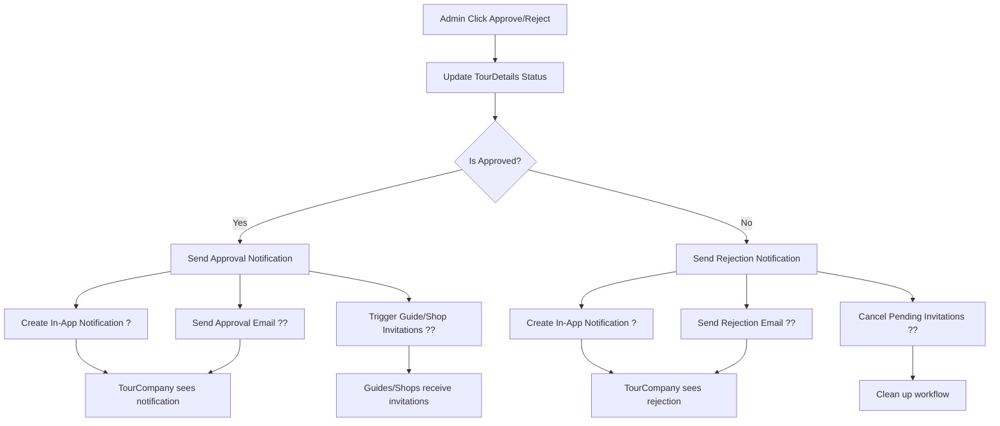

# ?? Admin Tour Approval/Rejection Notification System

## ?? **T?ng quan**

H? th?ng thông báo t? ??ng g?i ??n **TourCompany** khi admin duy?t ho?c t? ch?i tour details, bao g?m c? **email notification** và **in-app notification**.

---

## ?? **Thông báo ???c thêm m?i**

### **1. ? Thông báo DUY?T tour**

**Khi nào trigger:**
- Admin duy?t (approve) tour details
- Status chuy?n t? `Pending` ? `Approved`

**N?i dung thông báo:**

#### **?? In-App Notification:**
```json
{
  "title": "? Tour ???c duy?t",
  "message": "Tour 'Tên tour' ?ã ???c admin duy?t và có th? b?t ??u nh?n booking!",
  "type": "Tour",
  "priority": "High",
  "icon": "?",
  "actionUrl": "/tours/approved"
}
```

#### **?? Email Notification:**
- **Subject:** `?? Chúc m?ng! Tour 'Tên tour' ?ã ???c duy?t`
- **N?i dung:** 
  - Thông báo chúc m?ng
  - Nh?n xét t? admin (n?u có)
  - H??ng d?n b??c ti?p theo:
    - Ki?m tra l?i m?i h??ng d?n viên
    - Theo dõi ph?n h?i
    - Chu?n b? tour
    - Marketing
  - Link ??n dashboard

### **2. ? Thông báo T? CH?I tour**

**Khi nào trigger:**
- Admin t? ch?i (reject) tour details  
- Status chuy?n t? `Pending` ? `Rejected`

**N?i dung thông báo:**

#### **?? In-App Notification:**
```json
{
  "title": "? Tour b? t? ch?i",
  "message": "Tour 'Tên tour' ?ã b? admin t? ch?i. Vui lòng ki?m tra lý do và ch?nh s?a l?i.",
  "type": "Warning",
  "priority": "High", 
  "icon": "?",
  "actionUrl": "/tours/rejected"
}
```

#### **?? Email Notification:**
- **Subject:** `? Tour 'Tên tour' c?n ch?nh s?a`
- **N?i dung:**
  - Thông báo tour c?n ch?nh s?a
  - Lý do t? ch?i c? th? t? admin
  - H??ng d?n hành ??ng:
    - ??c k? ph?n h?i
    - Ch?nh s?a tour
    - Ki?m tra l?i
    - G?i l?i duy?t
  - G?i ý c?i thi?n
  - Thông tin liên h? support

---

## ?? **Technical Implementation**

### **1. ??? Interface Methods Added**

**ITourCompanyNotificationService.cs:**
```csharp
/// <summary>
/// G?i thông báo khi admin duy?t tour details
/// </summary>
Task<bool> NotifyTourApprovalAsync(
    Guid tourCompanyUserId,
    string tourDetailsTitle,
    string? adminComment = null);

/// <summary>
/// G?i thông báo khi admin t? ch?i tour details
/// </summary>
Task<bool> NotifyTourRejectionAsync(
    Guid tourCompanyUserId,
    string tourDetailsTitle,
    string rejectionReason);
```

### **2. ?? Service Implementation**

**TourCompanyNotificationService.cs:**
- ? `NotifyTourApprovalAsync()` - G?i thông báo duy?t tour
- ? `NotifyTourRejectionAsync()` - G?i thông báo t? ch?i tour
- ?? T? ??ng t?o both email + in-app notifications
- ?? Rich HTML email templates v?i styling

### **3. ?? Workflow Integration**

**TourDetailsService.ApproveRejectTourDetailAsync():**
```csharp
// Sau khi update status trong database
if (request.IsApproved)
{
    // ? G?i thông báo duy?t
    await notificationService.NotifyTourApprovalAsync(
        tourDetail.CreatedById,
        tourDetail.Title,
        request.Comment);
    
    // Trigger email invitations (existing)
    await TriggerApprovalEmailsAsync(tourDetail, adminId);
}
else
{
    // ? G?i thông báo t? ch?i
    await notificationService.NotifyTourRejectionAsync(
        tourDetail.CreatedById,
        tourDetail.Title,
        request.Comment!);
}
```

---

## ?? **API Usage Examples**

### **1. Admin duy?t tour:**

```http
POST /api/Admin/tourdetails/{tourDetailsId}/approve
Authorization: Bearer {admin-token}
Content-Type: application/json

{
  "comment": "Tour r?t hay, ?ã duy?t ?? public!"
}
```

**Response:**
```json
{
  "statusCode": 200,
  "message": "?ã duy?t tour detail thành công. Thông báo ?ã ???c g?i ??n Tour Company.",
  "success": true
}
```

**Notifications sent:**
- ? In-app notification v?i title "? Tour ???c duy?t"
- ?? Email chúc m?ng v?i subject "?? Chúc m?ng! Tour 'Tên tour' ?ã ???c duy?t"
- ?? Auto-trigger invitation emails to guides & shops

### **2. Admin t? ch?i tour:**

```http
POST /api/Admin/tourdetails/{tourDetailsId}/reject
Authorization: Bearer {admin-token}
Content-Type: application/json

{
  "comment": "Mô t? tour ch?a ?? chi ti?t, vui lòng b? sung thêm thông tin v? l?ch trình và ??a ?i?m tham quan."
}
```

**Response:**
```json
{
  "statusCode": 200,
  "message": "?ã t? ch?i tour detail thành công. Thông báo ?ã ???c g?i ??n Tour Company.",
  "success": true
}
```

**Notifications sent:**
- ? In-app notification v?i title "? Tour b? t? ch?i"
- ?? Email h??ng d?n v?i subject "? Tour 'Tên tour' c?n ch?nh s?a"
- ?? Cancel pending invitations

---

## ?? **Benefits**

### **?? Cho TourCompany:**
- ? **Thông báo ngay l?p t?c** khi admin x? lý tour
- ?? **C? email và in-app** notification ??m b?o không b? l?
- ?? **Ph?n h?i chi ti?t** t? admin ?? c?i thi?n tour
- ?? **H??ng d?n c? th?** v? b??c ti?p theo c?n làm
- ?? **Quick actions** thông qua action URLs

### **????? Cho Admin:**
- ? **T? ??ng hóa** vi?c thông báo sau khi approve/reject
- ?? **Tracking** ???c feedback ?ã g?i ??n tour company
- ?? **Workflow hi?u qu?** h?n v?i auto-trigger invitations

### **?? Cho H? th?ng:**
- ?? **T?ng engagement** v?i notification system
- ?? **Improve communication** gi?a admin và tour company
- ?? **Streamlined approval process** v?i t? ??ng hóa
- ?? **Better UX** v?i rich HTML emails và in-app notifications

---

## ?? **Notification Flow**



---

## ?? **Next Steps**

### **?? Có th? m? r?ng:**
1. **SMS notifications** cho nh?ng thông báo quan tr?ng
2. **Push notifications** cho mobile app
3. **Slack/Discord integration** cho team notifications
4. **Analytics dashboard** ?? track approval rates
5. **Auto-reminder** n?u tour company ch?a ??c thông báo

### **?? Metrics có th? track:**
- T? l? m? email notifications
- Th?i gian ph?n h?i c?a tour company sau rejection
- S? l?n tour ???c approve/reject
- Conversion rate t? pending ? approved

---

## ? **Summary**

**?ã hoàn thành:**
- ? Admin approval notification system
- ? Admin rejection notification system  
- ? Both email + in-app notifications
- ? Rich HTML email templates
- ? Integration v?i existing workflow
- ? Auto-trigger invitations sau approval
- ? Auto-cancel invitations sau rejection

**TourCompany gi? ?ây s? nh?n ???c thông báo ngay l?p t?c** khi admin duy?t ho?c t? ch?i tour, giúp h? có th? hành ??ng k?p th?i và hi?u qu? h?n! ??