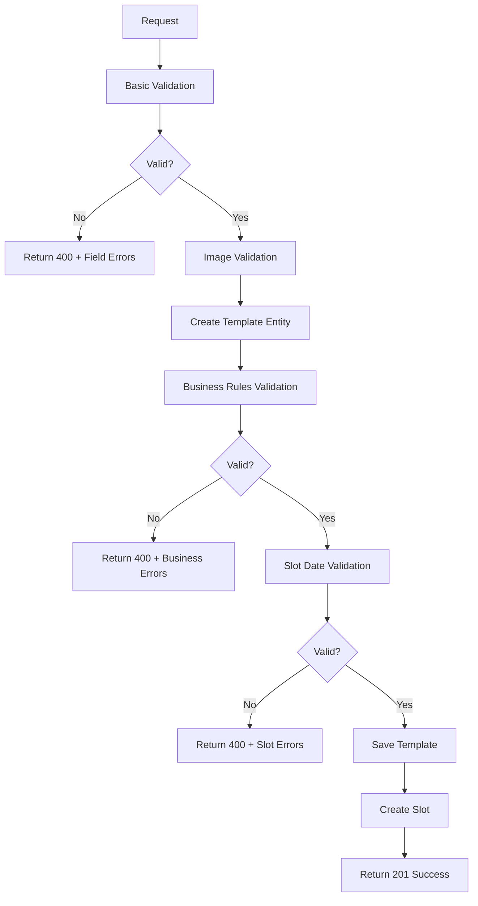

# Holiday Tour Template Validation Rules Summary

## ??? Validation ?ã ???c implement

Holiday Tour Template bây gi? áp d?ng **cùng business rules** nh? tour template bình th??ng ?? ??m b?o tính nh?t quán và ?áng tin c?y.

### ? ?ã thêm các Validation Rules:

#### 1. **?? Quy t?c 30 ngày** (Quan tr?ng nh?t)
```csharp
// Ngày tour ph?i sau ít nh?t 30 ngày t? ngày t?o template
var minimumDate = currentTime.AddDays(30);
if (tourDateTime < minimumDate) {
    // Báo l?i v?i g?i ý c? th?
}
```

**Ví d?**:
- Hôm nay: 15/01/2025
- Ngày s?m nh?t có th?: 14/02/2025
- G?i ý: 21/02/2025 (thêm 7 ngày an toàn)

#### 2. **?? Validation th?i gian**
```csharp
// Ph?i trong t??ng lai
if (request.TourDate <= DateOnly.FromDateTime(currentTime))

// Không quá 2 n?m
var maxFutureDate = DateOnly.FromDateTime(currentTime.AddYears(2));
if (request.TourDate > maxFutureDate)

// N?m h?p l? 2024-2030
if (request.TourDate.Year < 2024 || request.TourDate.Year > 2030)
```

#### 3. **?? Validation Business Rules**
```csharp
// Áp d?ng cùng business validation nh? regular template
var businessValidation = TourTemplateValidator.ValidateBusinessRules(tourTemplate);

// Ki?m tra slot date validation
var slotValidation = TourTemplateValidator.ValidateFirstSlotDate(
    tourTemplate.CreatedAt, 
    tourDateTime.Month, 
    tourDateTime.Year
);
```

#### 4. **?? Validation c? b?n**
- Title: B?t bu?c, max 200 ký t?
- StartLocation: B?t bu?c
- EndLocation: B?t bu?c
- Images: Tùy ch?n, max 10 items

## ?? Error Messages chi ti?t

### L?i vi ph?m 30 ngày:
```json
{
  "fieldErrors": {
    "tourDate": [
      "Ngày tour ph?i sau ít nh?t 30 ngày t? ngày t?o (15/01/2025). Ngày s?m nh?t có th?: 14/02/2025. G?i ý: Ch?n ngày 21/02/2025 ho?c mu?n h?n. Ví d? JSON h?p l?: \"tourDate\": \"2025-02-21\""
    ]
  },
  "validationErrors": [
    "?? H??NG D?N HOLIDAY TEMPLATE:",
    "• Ngày hi?n t?i: 15/01/2025 - KHÔNG th? ch?n",
    "• Ngày s?m nh?t: 14/02/2025 (sau 30 ngày)",
    "• Ngày mu?n nh?t: 15/01/2027 (t?i ?a 2 n?m)",
    "• Ví d? JSON h?p l?: {\"tourDate\": \"2025-02-21\"}",
    "• Khác template th??ng: Holiday template có th? ch?n b?t k? ngày nào trong tu?n"
  ]
}
```

## ?? So sánh Validation v?i Regular Template

| Rule | Regular Template | Holiday Template | Status |
|------|------------------|------------------|--------|
| **30-day rule** | ? Slot ??u tháng ph?i sau 30 ngày | ? TourDate ph?i sau 30 ngày | **SAME** |
| **Year range** | ? 2024-2030 | ? 2024-2030 | **SAME** |
| **Future date** | ? Tháng/n?m > hi?n t?i | ? TourDate > hi?n t?i | **SAME** |
| **Max range** | ? Không quá 2 n?m | ? Không quá 2 n?m | **SAME** |
| **Schedule day** | ?? Ch? Sat/Sun | ?? B?t k? ngày nào | **DIFFERENT** |
| **Input format** | Month + Year + ScheduleDay | TourDate | **DIFFERENT** |

## ? Validation Flow



## ?? Benefits c?a vi?c thêm Validation

### 1. **Tính nh?t quán**
- Cùng business rules cho c? 2 lo?i template
- Cùng error format và user experience

### 2. **B?o v? business logic**
- ??m b?o Tour Company có ?? th?i gian chu?n b? (30 ngày)
- Tránh t?o tour cho quá kh? ho?c quá xa trong t??ng lai

### 3. **User Experience t?t**
- Error messages chi ti?t v?i ví d? c? th?
- G?i ý ngày h?p l?
- H??ng d?n format JSON

### 4. **Maintainability**
- Tái s? d?ng validation logic ?ã có
- D? test và debug
- Consistent v?i existing codebase

## ?? Testing Scenarios

### ? Valid Cases:
```json
// Case 1: Ngày h?p l? (sau 30 ngày)
{"tourDate": "2025-02-21"} // Hôm nay: 15/01/2025

// Case 2: Ngày cu?i tu?n
{"tourDate": "2025-03-15"} // Saturday

// Case 3: Ngày trong tu?n  
{"tourDate": "2025-04-02"} // Wednesday
```

### ? Invalid Cases:
```json
// Case 1: Quá g?n (< 30 ngày)
{"tourDate": "2025-02-01"} // Ch? 17 ngày

// Case 2: Quá kh?
{"tourDate": "2025-01-10"} // ?ã qua

// Case 3: Quá xa (> 2 n?m)
{"tourDate": "2027-06-01"} // Quá 2 n?m
```

---

**Last Updated**: 15/01/2025  
**Version**: 2.0  
**Validation Status**: ? Complete