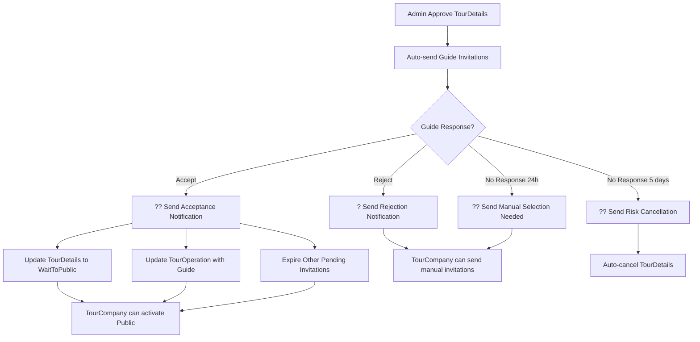

# ?? Tour Guide Acceptance Notification System

## ?? **T?ng quan**

H? th?ng thông báo t? ??ng g?i ??n **TourCompany** khi **TourGuide ch?p nh?n l?i m?i** tham gia tour, bao g?m c? **email notification** và **in-app notification**.

---

## ? **Thông báo ?ã ???c thêm**

### **?? Thông báo H??NG D?N VIÊN CH?P NH?N**

**Khi nào trigger:**
- TourGuide ch?p nh?n l?i m?i (accept invitation)
- Status invitation chuy?n t? `Pending` ? `Accepted`

**N?i dung thông báo:**

#### **?? In-App Notification:**
```json
{
  "title": "?? H??ng d?n viên ch?p nh?n!",
  "message": "{GuideName} ?ã ch?p nh?n l?i m?i cho tour '{TourTitle}'. Tour s?n sàng ?? public!",
  "type": "TourGuide",
  "priority": "High",
  "icon": "??",
  "actionUrl": "/tours/ready-to-public"
}
```

#### **?? Email Notification:**
- **Subject:** `?? Tuy?t v?i! H??ng d?n viên ?ã ch?p nh?n tour '{TourTitle}'`
- **N?i dung:** 
  - Thông báo chúc m?ng 
  - Thông tin h??ng d?n viên (tên, email, th?i gian ch?p nh?n)
  - H??ng d?n b??c ti?p theo:
    - Xác nh?n thông tin
    - Lên l?ch meeting
    - Kích ho?t Public
    - Marketing
  - G?i ý thành công
  - CTA buttons: "Liên h? h??ng d?n viên" & "Kích ho?t Public Tour"

---

## ?? **Technical Implementation**

### **1. ??? Interface Method Added**

**ITourCompanyNotificationService.cs:**
```csharp
/// <summary>
/// G?i thông báo khi TourGuide ch?p nh?n l?i m?i tour
/// </summary>
Task<bool> NotifyGuideAcceptanceAsync(
    Guid tourCompanyUserId,
    string tourDetailsTitle,
    string guideFullName,
    string guideEmail,
    DateTime acceptedAt);
```

### **2. ?? Service Implementation**

**TourCompanyNotificationService.cs:**
- ? `NotifyGuideAcceptanceAsync()` - G?i thông báo guide ch?p nh?n
- ?? T? ??ng t?o both email + in-app notifications
- ?? Rich HTML email template v?i styling và CTAs

### **3. ?? Workflow Integration**

**TourGuideInvitationService.AcceptInvitationAsync():**
```csharp
// Sau khi update invitation status và TourDetails status
try
{
    await _unitOfWork.SaveChangesAsync();
    
    // Update TourDetails status
    await UpdateTourDetailsStatusAfterGuideAcceptanceAsync(invitation.TourDetailsId, invitationId);
    
    // ?? SEND NOTIFICATION TO TOUR COMPANY
    await NotifyTourCompanyAboutGuideAcceptanceAsync(invitation, guideId);
}
catch (Exception saveEx)
{
    // Handle errors...
}
```

### **4. ?? Helper Method**

```csharp
/// <summary>
/// G?i thông báo cho TourCompany khi TourGuide ch?p nh?n l?i m?i
/// </summary>
private async Task NotifyTourCompanyAboutGuideAcceptanceAsync(TourGuideInvitation invitation, Guid guideId)
{
    // Get TourDetails and TourGuide info
    var tourDetails = await _unitOfWork.TourDetailsRepository.GetWithDetailsAsync(invitation.TourDetailsId);
    var tourGuide = await _unitOfWork.TourGuideRepository.GetByIdAsync(guideId);

    // Send notification
    await _notificationService.NotifyGuideAcceptanceAsync(
        tourDetails.CreatedById,
        tourDetails.Title,
        tourGuide.FullName,
        tourGuide.Email,
        invitation.RespondedAt ?? DateTime.UtcNow);
}
```

---

## ?? **API Flow Examples**

### **1. TourGuide ch?p nh?n l?i m?i:**

```http
POST /api/TourGuideInvitation/{invitationId}/accept
Authorization: Bearer {guide-token}
Content-Type: application/json

{
  "invitationId": "invitation-guid",
  "confirmUnderstanding": true
}
```

**Response:**
```json
{
  "statusCode": 200,
  "message": "?ã ch?p nh?n l?i m?i thành công",
  "success": true
}
```

**Notifications sent:**
- ?? In-app notification v?i title "?? H??ng d?n viên ch?p nh?n!"
- ?? Email chúc m?ng v?i subject "?? Tuy?t v?i! H??ng d?n viên ?ã ch?p nh?n tour..."
- ?? Auto-update TourDetails status to `WaitToPublic`
- ?? Auto-expire other pending invitations

---

## ?? **Benefits**

### **?? Cho TourCompany:**
- ? **Thông báo ngay l?p t?c** khi có guide ch?p nh?n
- ?? **C?m giác tích c?c** v?i tin t?t lành
- ?? **C? email và in-app** notification ?? không b? l?
- ????? **Thông tin chi ti?t guide** ?? liên h? ngay
- ?? **H??ng d?n c? th?** v? b??c ti?p theo
- ?? **Quick actions** ?? liên h? guide và kích ho?t tour

### **????? Cho TourGuide:**
- ? **Workflow m??t mà** sau khi accept invitation
- ?? **TourCompany s? liên h? s?m** ?? th?o lu?n chi ti?t
- ?? **Relationship building** t?t h?n v?i tour company

### **?? Cho H? th?ng:**
- ?? **T?ng engagement** v?i notification system
- ?? **Better communication** gi?a guide và tour company
- ? **Faster response time** t? tour company
- ?? **Complete notification coverage** cho toàn b? invitation workflow

---

## ?? **Complete Invitation Workflow Notifications**



---

## ?? **Notification Types Summary**

### **? Positive Notifications:**
1. **?? Guide Acceptance** - Khi guide ch?p nh?n l?i m?i
2. **? Tour Approval** - Khi admin duy?t tour

### **?? Action Required Notifications:**
1. **? Guide Rejection** - Khi guide t? ch?i l?i m?i
2. **? Manual Selection Needed** - Sau 24h không có guide accept
3. **?? Risk Cancellation** - 3 ngày tr??c h?y tour t? ??ng

### **?? Informational Notifications:**
1. **?? New Booking** - Khi có booking m?i
2. **?? Booking Cancellation** - Khi khách hàng h?y booking
3. **?? Revenue Transfer** - Khi ti?n ???c chuy?n vào ví

---

## ?? **Next Steps**

### **?? Có th? m? r?ng:**
1. **Guide Profile** trong notification ?? TourCompany bi?t thêm v? guide
2. **Auto-scheduling** meeting gi?a TourCompany và guide
3. **Tour preparation checklist** sau khi guide accept
4. **Real-time chat** integration gi?a TourCompany và guide
5. **Performance tracking** c?a guide sau tour hoàn thành

### **?? Metrics có th? track:**
- Response time c?a TourCompany sau khi nh?n notification
- Success rate c?a tours có guide accept invitation
- Satisfaction score c?a collaboration TourCompany-Guide
- Conversion rate t? acceptance ? successful tour

---

## ? **Summary**

**?ã hoàn thành:**
- ? TourGuide acceptance notification system
- ? Both email + in-app notifications  
- ? Rich HTML email template v?i CTAs
- ? Integration v?i existing invitation workflow
- ? Auto-update TourDetails status và TourOperation
- ? Complete notification coverage cho toàn b? invitation lifecycle

**TourCompany gi? ?ây s? nh?n ???c thông báo ngay l?p t?c** khi h??ng d?n viên ch?p nh?n l?i m?i, giúp h? có th? liên h? và chu?n b? tour k?p th?i! ??

**Workflow notification hoàn ch?nh:**
```
Admin Approve ? Auto Invitations ? Guide Accept ? ?? Notification ? TourCompany Action
```

H? th?ng gi? ?ây ?ã cover ??y ?? t?t c? các scenarios trong invitation workflow! ??