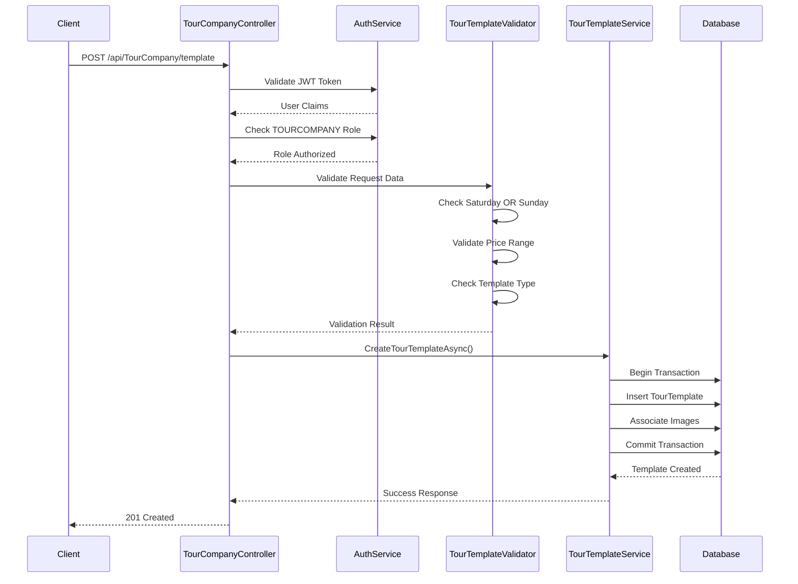
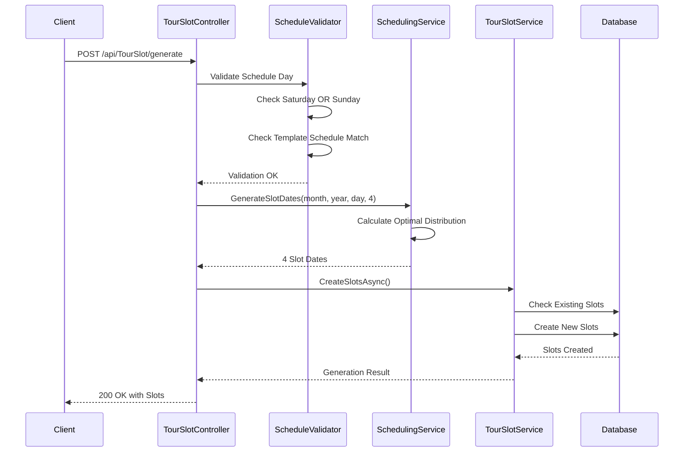
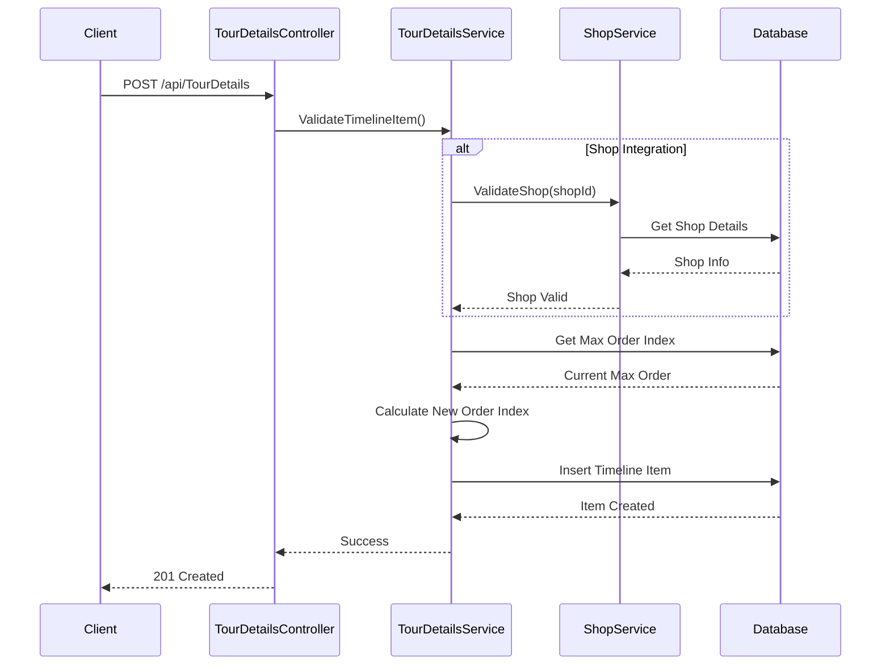
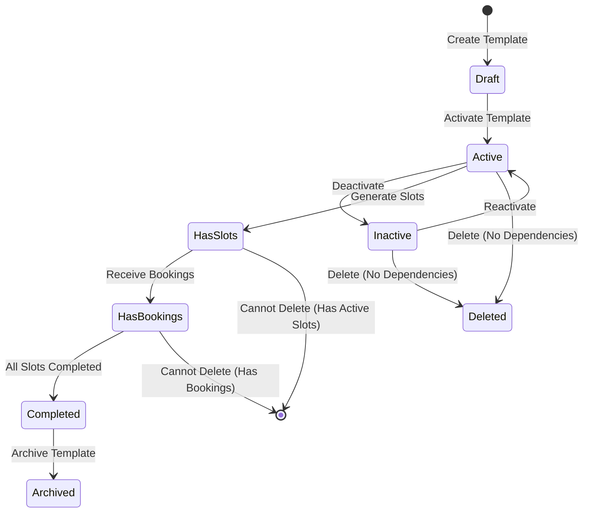
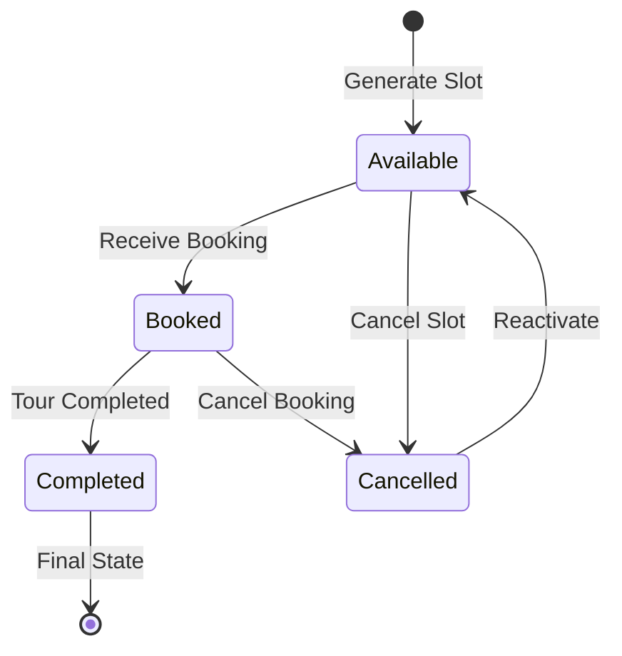
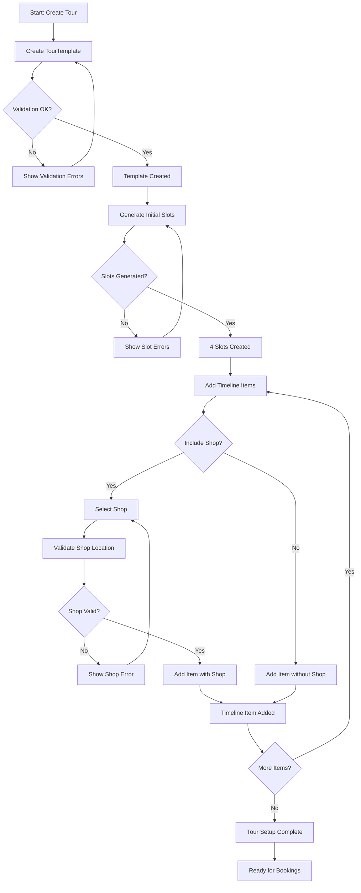
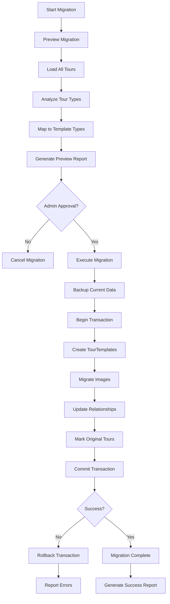

# TourTemplate API Flows Documentation

## 📋 Overview

Document này mô tả các flows và workflows chi tiết cho TourTemplate APIs, bao gồm business logic, validation steps, và integration patterns.

---

## 🔄 Core API Flows

### 1. **Create TourTemplate Flow**

#### **Flow Diagram**
```
[Client Request] → [Authentication] → [Role Check] → [Input Validation] → [Business Rules] → [Database] → [Response]
```

#### **Detailed Steps**

**Step 1: Authentication & Authorization**
```http
POST /api/TourCompany/template
Authorization: Bearer {jwt-token}
```

1. **JWT Token Validation**
   - Verify token signature
   - Check token expiration
   - Extract user claims

2. **Role Authorization**
   - Verify user has `TOURCOMPANY` role
   - Check user status (active/inactive)

**Step 2: Input Validation (Đã đơn giản hóa)**
```json
{
  "title": "Tour Núi Bà Đen",
  "templateType": "FreeScenic",
  "scheduleDays": "Saturday",
  "startLocation": "TP.HCM",
  "endLocation": "Tây Ninh",
  "month": 6,
  "year": 2025
}
```

**Validation Rules Applied:**
- `title`: Required, 1-200 chars
- `templateType`: Must be `FreeScenic` or `PaidAttraction`
- `scheduleDays`: Must be `Saturday` OR `Sunday` (not both)
- `startLocation`: Required, 1-500 chars
- `endLocation`: Required, 1-500 chars
- `month`: Required, 1-12
- `year`: Required, 2024-2030

**Step 3: Business Rules Validation**
```csharp
// Saturday OR Sunday constraint
var scheduleValidation = TourTemplateScheduleValidator.ValidateScheduleDay(request.ScheduleDays);

// Price consistency
if (request.ChildPrice > request.Price) {
    // Error: Child price cannot exceed adult price
}

// Template type validation
if (!Enum.IsDefined(typeof(TourTemplateType), request.TemplateType)) {
    // Error: Invalid template type
}
```

**Step 4: Database Operations**
```csharp
// Begin transaction
using var transaction = await _unitOfWork.BeginTransactionAsync();

try {
    // Create TourTemplate entity
    var template = new TourTemplate {
        Id = Guid.NewGuid(),
        Title = request.Title,
        CreatedById = currentUserId,
        CreatedAt = DateTime.UtcNow
    };
    
    // Save to database
    await _unitOfWork.TourTemplateRepository.AddAsync(template);
    
    // Handle image associations
    if (request.Images?.Any() == true) {
        await AssociateImagesAsync(template.Id, request.Images);
    }
    
    // Commit transaction
    await _unitOfWork.SaveChangesAsync();
    await transaction.CommitAsync();
    
} catch (Exception ex) {
    await transaction.RollbackAsync();
    throw;
}
```

**Step 5: Response Generation**
```json
{
  "statusCode": 201,
  "message": "Tạo tour template thành công",
  "data": {
    "id": "3fa85f64-5717-4562-b3fc-2c963f66afa6",
    "title": "Tour Núi Bà Đen",
    "templateType": "FreeScenic",
    "scheduleDays": "Saturday",
    "createdAt": "2025-06-03T10:00:00Z"
  }
}
```

#### **Error Flows**

**Authentication Error**:
```
[Invalid Token] → [401 Unauthorized] → [Error Response]
```

**Validation Error**:
```
[Invalid Data] → [400 Bad Request] → [Validation Error Response]
```

**Business Rule Error**:
```
[Saturday + Sunday] → [400 Bad Request] → [Schedule Constraint Error]
```

---

### 2. **Generate Tour Slots Flow**

#### **Flow Diagram**
```
[Request] → [Template Validation] → [Schedule Validation] → [Date Calculation] → [Slot Creation] → [Response]
```

#### **Detailed Steps**

**Step 1: Template Validation**
```csharp
// Verify template exists and user has access
var template = await _tourTemplateRepository.GetByIdAsync(request.TourTemplateId);
if (template == null || template.CreatedById != currentUserId) {
    return NotFound("Tour template not found or access denied");
}

// Check template is active
if (!template.IsActive) {
    return BadRequest("Cannot generate slots for inactive template");
}
```

**Step 2: Schedule Validation**
```csharp
// Validate Saturday OR Sunday constraint
var scheduleValidation = TourTemplateScheduleValidator.ValidateScheduleDayForSlotGeneration(
    request.ScheduleDays, request.Month, request.Year);

if (!scheduleValidation.IsValid) {
    return BadRequest(scheduleValidation.ErrorMessage);
}

// Check template schedule matches request
if (template.ScheduleDays != request.ScheduleDays) {
    return BadRequest("Schedule day must match template schedule");
}
```

**Step 3: Date Calculation**
```csharp
// Generate optimal slot dates (max 4 per month)
var slotDates = _schedulingService.GenerateSlotDates(
    year: request.Year,
    month: request.Month,
    scheduleDay: request.ScheduleDays,
    numberOfSlots: 4
);

// Check for existing slots
var existingSlots = await _tourSlotRepository.GetByTemplateAndMonthAsync(
    request.TourTemplateId, request.Month, request.Year);

if (!request.OverwriteExisting && existingSlots.Any()) {
    // Filter out dates that already have slots
    slotDates = slotDates.Where(date => 
        !existingSlots.Any(slot => slot.TourDate.Date == date.Date)).ToList();
}
```

**Step 4: Slot Creation**
```csharp
var createdSlots = new List<TourSlot>();

foreach (var slotDate in slotDates) {
    var slot = new TourSlot {
        Id = Guid.NewGuid(),
        TourTemplateId = request.TourTemplateId,
        TourDate = slotDate,
        ScheduleDay = request.ScheduleDays,
        Status = request.AutoActivate ? TourSlotStatus.Available : TourSlotStatus.Draft,
        MaxGuests = template.MaxGuests,
        MinGuests = template.MinGuests,
        CurrentBookings = 0,
        CreatedById = currentUserId,
        CreatedAt = DateTime.UtcNow
    };
    
    await _tourSlotRepository.AddAsync(slot);
    createdSlots.Add(slot);
}

await _unitOfWork.SaveChangesAsync();
```

**Step 5: Response Generation**
```json
{
  "statusCode": 200,
  "message": "Tạo 4 tour slots thành công",
  "data": {
    "success": true,
    "createdSlotsCount": 4,
    "skippedSlotsCount": 0,
    "createdSlots": [
      {
        "id": "slot-id-1",
        "tourDate": "2025-06-07",
        "scheduleDay": "Saturday",
        "status": "Available"
      }
    ]
  }
}
```

---

### 3. **Update TourTemplate Flow**

#### **Flow Diagram**
```
[PATCH Request] → [Ownership Check] → [Dependency Check] → [Partial Validation] → [Update] → [Response]
```

#### **Detailed Steps**

**Step 1: Ownership Validation**
```csharp
var template = await _tourTemplateRepository.GetByIdAsync(id);
if (template == null) {
    return NotFound("Tour template not found");
}

if (template.CreatedById != currentUserId) {
    return Forbid("You don't have permission to update this template");
}
```

**Step 2: Dependency Check**
```csharp
// Check for active slots
var activeSlots = await _tourSlotRepository.GetActiveSlotsByTemplateAsync(id);
if (activeSlots.Any()) {
    // Some fields cannot be updated if there are active slots
    var restrictedFields = new[] { "TemplateType", "ScheduleDays", "MaxGuests" };
    
    foreach (var field in restrictedFields) {
        if (request.HasProperty(field)) {
            return Conflict($"Cannot update {field} when template has active slots");
        }
    }
}
```

**Step 3: Partial Validation**
```csharp
// Only validate fields that are being updated
if (request.Title != null) {
    ValidateTitle(request.Title);
}

if (request.ScheduleDays.HasValue) {
    var scheduleValidation = TourTemplateScheduleValidator.ValidateScheduleDay(request.ScheduleDays.Value);
    if (!scheduleValidation.IsValid) {
        return BadRequest(scheduleValidation.ErrorMessage);
    }
}

if (request.Price.HasValue && request.ChildPrice.HasValue) {
    if (request.ChildPrice > request.Price) {
        return BadRequest("Child price cannot exceed adult price");
    }
}
```

**Step 4: Update Operations**
```csharp
// Apply partial updates
if (request.Title != null) template.Title = request.Title;
if (request.Description != null) template.Description = request.Description;
if (request.Price.HasValue) template.Price = request.Price.Value;
// ... other fields

template.UpdatedById = currentUserId;
template.UpdatedAt = DateTime.UtcNow;

await _tourTemplateRepository.Update(template);
await _unitOfWork.SaveChangesAsync();
```

---

### 4. **Delete TourTemplate Flow**

#### **Flow Diagram**
```
[DELETE Request] → [Ownership Check] → [Dependency Analysis] → [Soft Delete] → [Response]
```

#### **Detailed Steps**

**Step 1: Dependency Analysis**
```csharp
var dependencies = await AnalyzeDependenciesAsync(id);

var blockingReasons = new List<string>();

// Check active slots
if (dependencies.ActiveSlots > 0) {
    blockingReasons.Add($"Có {dependencies.ActiveSlots} tour slots đang active");
}

// Check pending bookings
if (dependencies.PendingBookings > 0) {
    blockingReasons.Add($"Có {dependencies.PendingBookings} bookings đang pending");
}

// Check future slots with bookings
if (dependencies.FutureSlotsWithBookings > 0) {
    blockingReasons.Add($"Có {dependencies.FutureSlotsWithBookings} slots trong tương lai có bookings");
}
```

**Step 2: Conditional Delete**
```csharp
if (blockingReasons.Any()) {
    return Conflict(new {
        statusCode = 409,
        message = "Không thể xóa tour template",
        data = new {
            canDelete = false,
            blockingReasons = blockingReasons
        }
    });
}

// Soft delete
template.IsDeleted = true;
template.DeletedAt = DateTime.UtcNow;
template.DeletedById = currentUserId;

await _tourTemplateRepository.Update(template);
await _unitOfWork.SaveChangesAsync();
```

---

### 5. **Timeline Management Flow**

#### **Get Timeline Flow**
```
[GET Request] → [Template Access Check] → [Load Timeline] → [Include Shop Info] → [Response]
```

#### **Add Timeline Item Flow**
```
[POST Request] → [Template Validation] → [Shop Validation] → [Order Index] → [Create Item] → [Response]
```

**Shop Integration Steps**:
```csharp
// Validate shop exists and is active
if (request.ShopId.HasValue) {
    var shop = await _shopRepository.GetByIdAsync(request.ShopId.Value);
    if (shop == null || !shop.IsActive) {
        return BadRequest("Shop not found or inactive");
    }
    
    // Verify shop location compatibility
    if (!IsShopLocationCompatible(shop.Location, template.EndLocation)) {
        return BadRequest("Shop location not compatible with tour route");
    }
}

// Auto-assign order index if not provided
if (!request.OrderIndex.HasValue) {
    var maxOrder = await _tourDetailsRepository.GetMaxOrderIndexAsync(request.TourTemplateId);
    request.OrderIndex = maxOrder + 1;
}
```

---

### 6. **Migration Flow**

#### **Preview Migration Flow**
```
[GET Preview] → [Load Tours] → [Analyze Mapping] → [Dry Run] → [Preview Response]
```

#### **Execute Migration Flow**
```
[POST Execute] → [Confirmation Check] → [Backup Data] → [Migrate Tours] → [Update Relations] → [Response]
```

**Migration Logic**:
```csharp
// Determine template type mapping
var templateType = DetermineTourTemplateType(tour.TourType);

// Map tour types to new enum
switch (tour.TourType?.ToLower()) {
    case "vui chơi":
    case "công viên":
    case "giải trí":
        return TourTemplateType.PaidAttraction;
    
    case "danh lam":
    case "thắng cảnh":
    case "văn hóa":
    case "lịch sử":
    default:
        return TourTemplateType.FreeScenic;
}

// Set default schedule day
var scheduleDay = ScheduleDay.Saturday; // Can be customized later

// Mark original tour as migrated
tour.Description = $"[MIGRATED TO TEMPLATE {newTemplate.Id}] {tour.Description}";
```

---

## 🔄 Integration Flows

### **Frontend Integration Flow**

#### **Complete Tour Creation Workflow (v2.0 - Simplified)**
```
1. [Load Simplified Template Form] → [9 fields only]
   ↓
2. [Validate Input] → [Show Errors]
   ↓
3. [Create Template] → [Success Response]
   ↓
4. [AUTO: Generate 4 Slots] → [For selected Month/Year]
   ↓
5. [Add Timeline Items] → [Shop Integration]
   ↓
6. [Template Ready] → [Redirect to Management]
```

**✨ New Feature**: Tự động generate slots sau khi tạo template thành công

#### **Template Management Workflow**
```
1. [List Templates] → [Pagination + Filters]
   ↓
2. [Select Template] → [View Details]
   ↓
3. [Edit Template] → [Dependency Check] → [Update/Error]
   ↓
4. [Manage Slots] → [Generate More/View Existing]
   ↓
5. [Timeline Management] → [Add/Edit/Reorder Items]
```

---

## 🚨 Error Handling Flows

### **Validation Error Flow**
```
[Invalid Input] → [Field Validation] → [Business Rules] → [Error Collection] → [400 Response]
```

### **Permission Error Flow**
```
[Unauthorized Action] → [Role Check] → [Ownership Check] → [403 Response]
```

### **Dependency Error Flow**
```
[Delete/Update Request] → [Dependency Analysis] → [Blocking Check] → [409 Response]
```

### **Server Error Flow**
```
[Exception] → [Error Logging] → [Transaction Rollback] → [500 Response]
```

---

## 📊 Performance Considerations

### **Database Query Optimization**
```csharp
// Use includes for related data
var templates = await _repository.GetAllAsync(
    include: new[] { "Images", "CreatedBy", "TourDetails.Shop" }
);

// Pagination for large datasets
var pagedResult = await _repository.GetPagedAsync(
    pageIndex: request.PageIndex,
    pageSize: request.PageSize,
    predicate: BuildFilterPredicate(request)
);
```

### **Caching Strategy**
```csharp
// Cache frequently accessed data
var cacheKey = $"template_{id}";
var template = await _cache.GetOrSetAsync(cacheKey, 
    () => _repository.GetByIdAsync(id),
    TimeSpan.FromMinutes(15)
);
```

---

## 🔐 Security Flows

### **Authentication Flow**
```
[JWT Token] → [Signature Validation] → [Expiry Check] → [Claims Extraction] → [User Context]
```

### **Authorization Flow**
```
[User Context] → [Role Check] → [Resource Ownership] → [Permission Grant/Deny]
```

### **Data Protection Flow**
```
[Sensitive Data] → [Encryption] → [Database Storage] → [Decryption] → [Response]
```

---

---

## 📈 Sequence Diagrams

### **Create TourTemplate Sequence**



### **Generate Slots Sequence**



### **Timeline Management Sequence**



---

## 🔄 State Transition Diagrams

### **TourTemplate State Flow**



### **TourSlot State Flow**



---

## 🔀 Business Process Flows

### **Complete Tour Setup Process**



### **Migration Process Flow**



---

## 📋 API Flow Summary

### **Key Flow Patterns**

1. **Authentication First**: Tất cả flows đều bắt đầu với JWT validation
2. **Role-Based Access**: TOURCOMPANY role required cho template operations
3. **Validation Layers**: Input → Business Rules → Database constraints
4. **Transaction Safety**: Database operations wrapped trong transactions
5. **Error Handling**: Comprehensive error responses với detailed messages
6. **Dependency Checks**: Verify relationships trước khi delete/update
7. **Audit Trail**: Track all changes với user context

### **Performance Optimizations**

1. **Eager Loading**: Include related entities để reduce queries
2. **Pagination**: Large datasets được paginated
3. **Caching**: Frequently accessed data được cached
4. **Async Operations**: All database operations are async
5. **Connection Pooling**: Efficient database connection management

### **Security Measures**

1. **JWT Authentication**: Secure token-based authentication
2. **Role Authorization**: Fine-grained permission control
3. **Ownership Validation**: Users can only modify their own resources
4. **Input Sanitization**: All inputs validated và sanitized
5. **SQL Injection Prevention**: Entity Framework parameterized queries

Tất cả flows trên đã được implement và tested trong TayNinhTourBE system! 🚀
