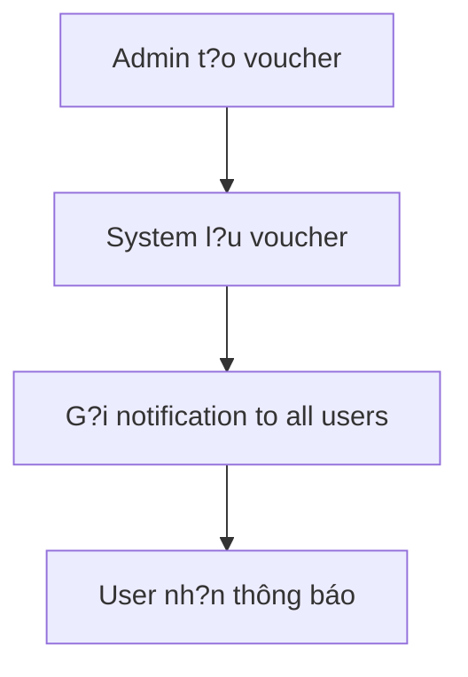
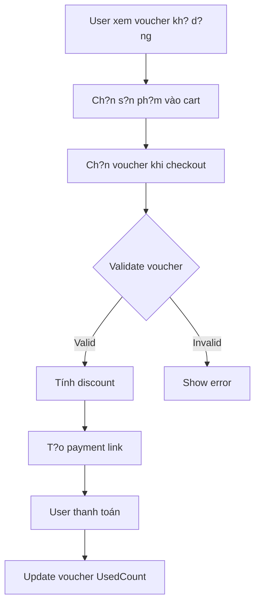

# ?? H? Th?ng Voucher - H??ng D?n Frontend Integration

## ?? M?c l?c
1. [T?ng quan h? th?ng](#t?ng-quan-h?-th?ng)
2. [Lu?ng ho?t ??ng](#lu?ng-ho?t-??ng)
3. [API Endpoints](#api-endpoints)
4. [Models & DTOs](#models--dtos)
5. [Frontend Implementation](#frontend-implementation)
6. [UI/UX Guidelines](#uiux-guidelines)
7. [Testing & Examples](#testing--examples)
8. [Error Handling](#error-handling)

---

## ?? T?ng quan h? th?ng

H? th?ng voucher ?ã ???c **??n gi?n hóa** t? mô hình ph?c t?p v?i VoucherCode sang mô hình tr?c ti?p. Thay vì ph?i claim voucher code tr??c khi s? d?ng, ng??i dùng gi? có th? áp d?ng voucher tr?c ti?p khi checkout.

### ??c ?i?m chính:
- ? **Không c?n claim voucher** - Áp d?ng tr?c ti?p b?ng VoucherId
- ? **H? th?ng ??n gi?n** - Qu?n lý b?ng Quantity & UsedCount
- ? **T? ??ng thông báo** - G?i thông báo ??n t?t c? user khi có voucher m?i
- ? **Validation thông minh** - Không cho dùng voucher trên s?n ph?m ?ang sale

---

## ?? Lu?ng ho?t ??ng

### 1. Admin t?o voucher


### 2. User s? d?ng voucher


---

## ?? API Endpoints

### Base URL: `https://localhost:7205/api/Product`

### ?? **Admin Endpoints**

#### 1. T?o voucher m?i
```http
POST /api/Product/Create-Voucher
Authorization: Bearer {admin_token}
Content-Type: application/json
```

**Request Body:**
```json
{
    "name": "Flash Sale Cu?i Tu?n",
    "description": "Gi?m giá s?n ph?m cu?i tu?n",
    "quantity": 100,
    "discountAmount": 50000,
    "discountPercent": null,
    "startDate": "2024-01-15T00:00:00Z",
    "endDate": "2024-01-21T23:59:59Z"
}
```

**Response:**
```json
{
    "statusCode": 200,
    "message": "Voucher ?ã ???c t?o thành công và thông báo ?ã ???c g?i ??n t?t c? ng??i dùng",
    "success": true,
    "voucherId": "550e8400-e29b-41d4-a716-446655440000",
    "voucherName": "Flash Sale Cu?i Tu?n",
    "quantity": 100
}
```

#### 2. Xem t?t c? voucher (Admin)
```http
GET /api/Product/GetAll-Voucher?pageIndex=1&pageSize=10&textSearch=&status=true
Authorization: Bearer {admin_token}
```

**Response:**
```json
{
    "statusCode": 200,
    "message": "L?y danh sách voucher thành công",
    "success": true,
    "data": [
        {
            "id": "550e8400-e29b-41d4-a716-446655440000",
            "name": "Flash Sale Cu?i Tu?n",
            "description": "Gi?m giá s?n ph?m cu?i tu?n",
            "quantity": 100,
            "usedCount": 15,
            "remainingCount": 85,
            "discountAmount": 50000,
            "discountPercent": null,
            "startDate": "2024-01-15T00:00:00Z",
            "endDate": "2024-01-21T23:59:59Z",
            "isActive": true,
            "isExpired": false,
            "isAvailable": true,
            "createdAt": "2024-01-14T10:00:00Z"
        }
    ],
    "totalRecord": 1,
    "totalPages": 1
}
```

#### 3. C?p nh?t voucher
```http
PUT /api/Product/Update-Voucher/{voucherId}
Authorization: Bearer {admin_token}
Content-Type: application/json
```

#### 4. Xóa voucher
```http
DELETE /api/Product/Voucher/{voucherId}
Authorization: Bearer {admin_token}
```

### ?? **User Endpoints**

#### 1. Xem voucher kh? d?ng
```http
GET /api/Product/GetAvailable-Vouchers?pageIndex=1&pageSize=10
Authorization: Bearer {user_token}
```

**Response:**
```json
{
    "statusCode": 200,
    "message": "L?y danh sách voucher kh? d?ng thành công",
    "success": true,
    "data": [
        {
            "id": "550e8400-e29b-41d4-a716-446655440000",
            "name": "Flash Sale Cu?i Tu?n",
            "description": "Gi?m giá s?n ph?m cu?i tu?n",
            "discountAmount": 50000,
            "discountPercent": null,
            "remainingCount": 85,
            "startDate": "2024-01-15T00:00:00Z",
            "endDate": "2024-01-21T23:59:59Z",
            "isExpiringSoon": false
        }
    ],
    "totalRecord": 1,
    "totalPages": 1
}
```

#### 2. Áp d?ng voucher khi checkout
```http
POST /api/Product/checkout
Authorization: Bearer {user_token}
Content-Type: application/json
```

**Request Body:**
```json
{
    "cartItemIds": [
        "123e4567-e89b-12d3-a456-426614174001",
        "123e4567-e89b-12d3-a456-426614174002"
    ],
    "voucherId": "550e8400-e29b-41d4-a716-446655440000"
}
```

**Response:**
```json
{
    "checkoutUrl": "https://checkout.payos.vn/web/...",
    "orderId": "789e0123-e45f-67g8-h901-234567890123",
    "totalOriginal": 60000,
    "discountAmount": 50000,
    "totalAfterDiscount": 10000
}
```

---

## ?? Models & DTOs

### VoucherDto
```typescript
interface VoucherDto {
    id: string;
    name: string;
    description?: string;
    quantity: number;
    usedCount: number;
    remainingCount: number;
    discountAmount: number;
    discountPercent?: number;
    startDate: string;
    endDate: string;
    isActive: boolean;
    isExpired: boolean;
    isAvailable: boolean;
    createdAt: string;
}
```

### AvailableVoucherDto
```typescript
interface AvailableVoucherDto {
    id: string;
    name: string;
    description?: string;
    discountAmount: number;
    discountPercent?: number;
    remainingCount: number;
    startDate: string;
    endDate: string;
    isExpiringSoon: boolean;
}
```

### CreateVoucherDto
```typescript
interface CreateVoucherDto {
    name: string;
    description?: string;
    quantity: number;
    discountAmount: number;
    discountPercent?: number;
    startDate: string;
    endDate: string;
}
```

### CheckoutDto
```typescript
interface CheckoutSelectedCartItemsDto {
    cartItemIds: string[];
    voucherId?: string;
}
```

---

## ?? Frontend Implementation

### 1. Voucher Service
```typescript
class VoucherService {
    private apiUrl = 'https://localhost:7205/api/Product';
    
    // L?y danh sách voucher kh? d?ng cho user
    async getAvailableVouchers(page = 1, pageSize = 10): Promise<AvailableVoucherDto[]> {
        const response = await fetch(
            `${this.apiUrl}/GetAvailable-Vouchers?pageIndex=${page}&pageSize=${pageSize}`,
            {
                headers: {
                    'Authorization': `Bearer ${getToken()}`,
                    'Content-Type': 'application/json'
                }
            }
        );
        
        const result = await response.json();
        return result.success ? result.data : [];
    }
    
    // Admin: T?o voucher m?i
    async createVoucher(voucher: CreateVoucherDto): Promise<any> {
        const response = await fetch(`${this.apiUrl}/Create-Voucher`, {
            method: 'POST',
            headers: {
                'Authorization': `Bearer ${getAdminToken()}`,
                'Content-Type': 'application/json'
            },
            body: JSON.stringify(voucher)
        });
        
        return await response.json();
    }
    
    // Admin: L?y t?t c? voucher
    async getAllVouchers(page = 1, pageSize = 10, search = '', status?: boolean): Promise<VoucherDto[]> {
        const params = new URLSearchParams({
            pageIndex: page.toString(),
            pageSize: pageSize.toString(),
            textSearch: search,
            ...(status !== undefined && { status: status.toString() })
        });
        
        const response = await fetch(`${this.apiUrl}/GetAll-Voucher?${params}`, {
            headers: {
                'Authorization': `Bearer ${getAdminToken()}`,
                'Content-Type': 'application/json'
            }
        });
        
        const result = await response.json();
        return result.success ? result.data : [];
    }
}
```

### 2. Checkout v?i Voucher
```typescript
class CheckoutService {
    private apiUrl = 'https://localhost:7205/api/Product';
    
    async checkoutWithVoucher(cartItemIds: string[], voucherId?: string): Promise<any> {
        const payload: CheckoutSelectedCartItemsDto = {
            cartItemIds,
            ...(voucherId && { voucherId })
        };
        
        const response = await fetch(`${this.apiUrl}/checkout`, {
            method: 'POST',
            headers: {
                'Authorization': `Bearer ${getToken()}`,
                'Content-Type': 'application/json'
            },
            body: JSON.stringify(payload)
        });
        
        const result = await response.json();
        
        if (!response.ok) {
            throw new Error(result.message || 'Checkout failed');
        }
        
        return result;
    }
    
    // Tính toán preview v?i voucher
    calculateDiscountPreview(total: number, voucher: AvailableVoucherDto): {
        discountAmount: number;
        finalTotal: number;
    } {
        let discountAmount = 0;
        
        if (voucher.discountAmount > 0) {
            discountAmount = voucher.discountAmount;
        } else if (voucher.discountPercent && voucher.discountPercent > 0) {
            discountAmount = total * voucher.discountPercent / 100;
        }
        
        if (discountAmount > total) {
            discountAmount = total;
        }
        
        return {
            discountAmount,
            finalTotal: Math.max(total - discountAmount, 1) // PayOS minimum 1 VN?
        };
    }
}
```

### 3. React Components

#### Voucher Selector Component
```tsx
interface VoucherSelectorProps {
    selectedVoucherId?: string;
    onVoucherSelect: (voucherId: string | undefined) => void;
    cartTotal: number;
}

const VoucherSelector: React.FC<VoucherSelectorProps> = ({
    selectedVoucherId,
    onVoucherSelect,
    cartTotal
}) => {
    const [vouchers, setVouchers] = useState<AvailableVoucherDto[]>([]);
    const [loading, setLoading] = useState(false);
    
    const voucherService = new VoucherService();
    const checkoutService = new CheckoutService();
    
    useEffect(() => {
        loadVouchers();
    }, []);
    
    const loadVouchers = async () => {
        setLoading(true);
        try {
            const data = await voucherService.getAvailableVouchers();
            setVouchers(data);
        } catch (error) {
            console.error('Error loading vouchers:', error);
        } finally {
            setLoading(false);
        }
    };
    
    const calculateDiscount = (voucher: AvailableVoucherDto) => {
        return checkoutService.calculateDiscountPreview(cartTotal, voucher);
    };
    
    return (
        <div className="voucher-selector">
            <h3>?? Ch?n Voucher</h3>
            
            {loading ? (
                <div>?ang t?i voucher...</div>
            ) : (
                <div className="voucher-list">
                    <div 
                        className={`voucher-item ${!selectedVoucherId ? 'selected' : ''}`}
                        onClick={() => onVoucherSelect(undefined)}
                    >
                        <div className="voucher-content">
                            <h4>Không s? d?ng voucher</h4>
                            <p>Thanh toán: {cartTotal.toLocaleString()} VN?</p>
                        </div>
                    </div>
                    
                    {vouchers.map(voucher => {
                        const { discountAmount, finalTotal } = calculateDiscount(voucher);
                        const isSelected = selectedVoucherId === voucher.id;
                        
                        return (
                            <div 
                                key={voucher.id}
                                className={`voucher-item ${isSelected ? 'selected' : ''}`}
                                onClick={() => onVoucherSelect(voucher.id)}
                            >
                                <div className="voucher-content">
                                    <h4>{voucher.name}</h4>
                                    <p>{voucher.description}</p>
                                    <div className="voucher-discount">
                                        {voucher.discountAmount > 0 ? (
                                            <span>Gi?m {voucher.discountAmount.toLocaleString()} VN?</span>
                                        ) : (
                                            <span>Gi?m {voucher.discountPercent}%</span>
                                        )}
                                    </div>
                                    <div className="price-calculation">
                                        <div className="original-price">
                                            T?ng: <span className="strikethrough">{cartTotal.toLocaleString()} VN?</span>
                                        </div>
                                        <div className="discount-amount">
                                            Gi?m: -{discountAmount.toLocaleString()} VN?
                                        </div>
                                        <div className="final-price">
                                            <strong>Thanh toán: {finalTotal.toLocaleString()} VN?</strong>
                                        </div>
                                    </div>
                                    <div className="voucher-meta">
                                        <span>Còn l?i: {voucher.remainingCount}</span>
                                        {voucher.isExpiringSoon && (
                                            <span className="expiring-soon">?? S?p h?t h?n</span>
                                        )}
                                    </div>
                                </div>
                            </div>
                        );
                    })}
                </div>
            )}
        </div>
    );
};
```

#### Admin Voucher Management
```tsx
const VoucherManagement: React.FC = () => {
    const [vouchers, setVouchers] = useState<VoucherDto[]>([]);
    const [showCreateModal, setShowCreateModal] = useState(false);
    const [loading, setLoading] = useState(false);
    
    const voucherService = new VoucherService();
    
    useEffect(() => {
        loadVouchers();
    }, []);
    
    const loadVouchers = async () => {
        setLoading(true);
        try {
            const data = await voucherService.getAllVouchers();
            setVouchers(data);
        } catch (error) {
            console.error('Error loading vouchers:', error);
        } finally {
            setLoading(false);
        }
    };
    
    const handleCreateVoucher = async (voucherData: CreateVoucherDto) => {
        try {
            const result = await voucherService.createVoucher(voucherData);
            if (result.success) {
                toast.success(result.message);
                loadVouchers(); // Reload list
                setShowCreateModal(false);
            } else {
                toast.error(result.message);
            }
        } catch (error) {
            toast.error('Có l?i x?y ra khi t?o voucher');
        }
    };
    
    return (
        <div className="voucher-management">
            <div className="header">
                <h2>Qu?n lý Voucher</h2>
                <button 
                    className="btn btn-primary"
                    onClick={() => setShowCreateModal(true)}
                >
                    + T?o Voucher M?i
                </button>
            </div>
            
            <div className="voucher-table">
                {loading ? (
                    <div>?ang t?i...</div>
                ) : (
                    <table>
                        <thead>
                            <tr>
                                <th>Tên Voucher</th>
                                <th>Lo?i Gi?m Giá</th>
                                <th>S? L??ng</th>
                                <th>?ã Dùng</th>
                                <th>Còn L?i</th>
                                <th>Tr?ng Thái</th>
                                <th>Hành ??ng</th>
                            </tr>
                        </thead>
                        <tbody>
                            {vouchers.map(voucher => (
                                <tr key={voucher.id}>
                                    <td>
                                        <div>
                                            <strong>{voucher.name}</strong>
                                            <br />
                                            <small>{voucher.description}</small>
                                        </div>
                                    </td>
                                    <td>
                                        {voucher.discountAmount > 0 ? (
                                            <span>-{voucher.discountAmount.toLocaleString()} VN?</span>
                                        ) : (
                                            <span>-{voucher.discountPercent}%</span>
                                        )}
                                    </td>
                                    <td>{voucher.quantity}</td>
                                    <td>{voucher.usedCount}</td>
                                    <td>{voucher.remainingCount}</td>
                                    <td>
                                        <span className={`status ${voucher.isActive ? 'active' : 'inactive'}`}>
                                            {voucher.isActive ? 'Ho?t ??ng' : 'T?m d?ng'}
                                        </span>
                                        {voucher.isExpired && (
                                            <span className="status expired">H?t h?n</span>
                                        )}
                                    </td>
                                    <td>
                                        <button className="btn btn-sm btn-secondary">S?a</button>
                                        <button className="btn btn-sm btn-danger">Xóa</button>
                                    </td>
                                </tr>
                            ))}
                        </tbody>
                    </table>
                )}
            </div>
            
            {showCreateModal && (
                <CreateVoucherModal
                    onClose={() => setShowCreateModal(false)}
                    onSubmit={handleCreateVoucher}
                />
            )}
        </div>
    );
};
```

---

## ?? UI/UX Guidelines

### 1. Voucher Card Design
```css
.voucher-item {
    border: 2px solid #e1e5e9;
    border-radius: 12px;
    padding: 16px;
    margin-bottom: 12px;
    cursor: pointer;
    transition: all 0.3s ease;
    position: relative;
}

.voucher-item:hover {
    border-color: #007bff;
    box-shadow: 0 4px 12px rgba(0,123,255,0.15);
}

.voucher-item.selected {
    border-color: #28a745;
    background-color: #f8fff9;
}

.voucher-item.selected::after {
    content: "?";
    position: absolute;
    top: 8px;
    right: 8px;
    background: #28a745;
    color: white;
    border-radius: 50%;
    width: 24px;
    height: 24px;
    display: flex;
    align-items: center;
    justify-content: center;
    font-size: 14px;
}

.voucher-discount {
    background: linear-gradient(45deg, #ff6b6b, #ffa500);
    color: white;
    padding: 4px 8px;
    border-radius: 16px;
    font-size: 12px;
    font-weight: bold;
    display: inline-block;
    margin: 8px 0;
}

.price-calculation {
    border-top: 1px dashed #ccc;
    padding-top: 8px;
    margin-top: 8px;
}

.original-price .strikethrough {
    text-decoration: line-through;
    color: #666;
}

.discount-amount {
    color: #dc3545;
    font-weight: 500;
}

.final-price {
    color: #28a745;
    font-size: 16px;
    margin-top: 4px;
}

.expiring-soon {
    color: #ffa500;
    font-weight: bold;
    font-size: 11px;
}
```

### 2. Checkout Summary v?i Voucher
```tsx
const CheckoutSummary: React.FC = ({ cartItems, selectedVoucher, total }) => {
    const discount = selectedVoucher ? calculateDiscount(total, selectedVoucher) : 0;
    const finalTotal = total - discount;
    
    return (
        <div className="checkout-summary">
            <h3>Tóm t?t ??n hàng</h3>
            
            <div className="summary-line">
                <span>T?m tính ({cartItems.length} s?n ph?m)</span>
                <span>{total.toLocaleString()} VN?</span>
            </div>
            
            {selectedVoucher && (
                <div className="summary-line discount-line">
                    <span>
                        ?? {selectedVoucher.name}
                        <small className="voucher-desc">{selectedVoucher.description}</small>
                    </span>
                    <span className="discount-amount">-{discount.toLocaleString()} VN?</span>
                </div>
            )}
            
            <div className="summary-line total-line">
                <span><strong>T?ng c?ng</strong></span>
                <span className="final-total"><strong>{finalTotal.toLocaleString()} VN?</strong></span>
            </div>
            
            {discount > 0 && (
                <div className="savings-highlight">
                    ?? B?n ti?t ki?m ???c {discount.toLocaleString()} VN?!
                </div>
            )}
        </div>
    );
};
```

### 3. Thông báo Voucher m?i
```tsx
const VoucherNotification: React.FC = ({ notification }) => {
    return (
        <div className="voucher-notification">
            <div className="notification-icon">??</div>
            <div className="notification-content">
                <h4>{notification.title}</h4>
                <p>{notification.message}</p>
                <button className="btn-view-vouchers">
                    Xem voucher ngay
                </button>
            </div>
        </div>
    );
};
```

---

## ?? Testing & Examples

### 1. Test Data
```typescript
// Mock voucher data for testing
const mockVouchers: AvailableVoucherDto[] = [
    {
        id: "voucher-1",
        name: "Gi?m 50K cho ??n t? 100K",
        description: "Áp d?ng cho t?t c? s?n ph?m",
        discountAmount: 50000,
        discountPercent: null,
        remainingCount: 45,
        startDate: "2024-01-01T00:00:00Z",
        endDate: "2024-01-31T23:59:59Z",
        isExpiringSoon: false
    },
    {
        id: "voucher-2", 
        name: "Gi?m 20% t?i ?a 100K",
        description: "Flash sale cu?i tu?n",
        discountAmount: 0,
        discountPercent: 20,
        remainingCount: 12,
        startDate: "2024-01-15T00:00:00Z",
        endDate: "2024-01-21T23:59:59Z",
        isExpiringSoon: true
    }
];
```

### 2. Test Scenarios
```typescript
describe('Voucher System Tests', () => {
    test('should calculate fixed amount discount correctly', () => {
        const voucher = mockVouchers[0]; // 50K discount
        const cartTotal = 120000;
        
        const result = calculateDiscount(cartTotal, voucher);
        
        expect(result.discountAmount).toBe(50000);
        expect(result.finalTotal).toBe(70000);
    });
    
    test('should calculate percentage discount correctly', () => {
        const voucher = mockVouchers[1]; // 20% discount
        const cartTotal = 100000;
        
        const result = calculateDiscount(cartTotal, voucher);
        
        expect(result.discountAmount).toBe(20000);
        expect(result.finalTotal).toBe(80000);
    });
    
    test('should not exceed cart total for discount', () => {
        const voucher = mockVouchers[0]; // 50K discount
        const cartTotal = 30000; // Less than discount
        
        const result = calculateDiscount(cartTotal, voucher);
        
        expect(result.discountAmount).toBe(30000);
        expect(result.finalTotal).toBe(1); // PayOS minimum
    });
});
```

---

## ?? Error Handling

### 1. Common Error Responses
```typescript
interface ApiError {
    statusCode: number;
    message: string;
    success: false;
    validationErrors?: string[];
}

// Example error responses:
const errorResponses = {
    VOUCHER_NOT_FOUND: {
        statusCode: 404,
        message: "Voucher không t?n t?i ho?c không kh? d?ng",
        success: false
    },
    PRODUCT_ON_SALE: {
        statusCode: 400,
        message: "S?n ph?m \"Tên s?n ph?m\" ?ang ???c gi?m giá, không th? áp d?ng voucher",
        success: false
    },
    VOUCHER_EXPIRED: {
        statusCode: 400,
        message: "Voucher ?ã h?t h?n",
        success: false
    },
    NO_REMAINING_USES: {
        statusCode: 400,
        message: "Voucher ?ã h?t l??t s? d?ng",
        success: false
    }
};
```

### 2. Error Handling Implementation
```typescript
class ErrorHandler {
    static handleVoucherError(error: ApiError): string {
        switch (error.statusCode) {
            case 404:
                return "Voucher không t?n t?i ho?c ?ã b? xóa";
            case 400:
                if (error.message.includes("?ang ???c gi?m giá")) {
                    return "Không th? s? d?ng voucher cho s?n ph?m ?ang sale";
                }
                if (error.message.includes("h?t h?n")) {
                    return "Voucher ?ã h?t h?n s? d?ng";
                }
                if (error.message.includes("h?t l??t")) {
                    return "Voucher ?ã h?t l??t s? d?ng";
                }
                return error.message;
            case 401:
                return "B?n c?n ??ng nh?p ?? s? d?ng voucher";
            case 403:
                return "B?n không có quy?n s? d?ng voucher này";
            default:
                return "Có l?i x?y ra khi áp d?ng voucher";
        }
    }
    
    static showVoucherError(error: ApiError) {
        const message = this.handleVoucherError(error);
        toast.error(message);
    }
}
```

### 3. Validation tr??c khi g?i API
```typescript
const validateVoucherSelection = (
    voucher: AvailableVoucherDto, 
    cartItems: CartItem[]
): string | null => {
    const now = new Date();
    const endDate = new Date(voucher.endDate);
    
    // Check expiry
    if (endDate < now) {
        return "Voucher ?ã h?t h?n";
    }
    
    // Check remaining uses
    if (voucher.remainingCount <= 0) {
        return "Voucher ?ã h?t l??t s? d?ng";
    }
    
    // Check if any product is on sale (client-side pre-check)
    const hasProductOnSale = cartItems.some(item => item.isSale);
    if (hasProductOnSale) {
        return "Không th? s? d?ng voucher khi có s?n ph?m ?ang sale trong gi? hàng";
    }
    
    return null; // Valid
};
```

---

## ?? Mobile Considerations

### 1. Responsive Voucher Cards
```css
@media (max-width: 768px) {
    .voucher-item {
        padding: 12px;
        margin-bottom: 8px;
    }
    
    .voucher-content h4 {
        font-size: 14px;
    }
    
    .price-calculation {
        font-size: 13px;
    }
    
    .voucher-list {
        max-height: 60vh;
        overflow-y: auto;
    }
}
```

### 2. Touch-friendly interactions
```tsx
const MobileVoucherSelector: React.FC = () => {
    return (
        <div className="mobile-voucher-selector">
            <button 
                className="voucher-toggle-btn"
                onClick={() => setShowVouchers(!showVouchers)}
            >
                ?? {selectedVoucher ? selectedVoucher.name : 'Ch?n voucher'}
                <span className="chevron">{showVouchers ? '?' : '?'}</span>
            </button>
            
            {showVouchers && (
                <div className="voucher-dropdown">
                    {/* Voucher list */}
                </div>
            )}
        </div>
    );
};
```

---

## ?? Integration Checklist

- [ ] **API Integration**
  - [ ] Implement VoucherService v?i t?t c? endpoints
  - [ ] Handle authentication headers
  - [ ] Implement error handling và retry logic

- [ ] **UI Components**
  - [ ] VoucherSelector component
  - [ ] CheckoutSummary v?i voucher calculation
  - [ ] Admin VoucherManagement component
  - [ ] VoucherNotification component

- [ ] **State Management**
  - [ ] Voucher store/context
  - [ ] Cart state v?i voucher selection
  - [ ] Notification state for voucher alerts

- [ ] **Testing**
  - [ ] Unit tests cho discount calculation
  - [ ] Integration tests v?i API
  - [ ] E2E tests cho checkout flow

- [ ] **Performance**
  - [ ] Lazy loading vouchers
  - [ ] Caching available vouchers
  - [ ] Debounce voucher selection

---

## ?? Support & Documentation

### API Base URLs:
- **Development**: `https://localhost:7205/api/Product`
- **Production**: `https://your-domain.com/api/Product`

### Key Contacts:
- **Backend Team**: ?? h?i v? API endpoints và business logic
- **QA Team**: ?? test scenarios và edge cases  
- **Product Team**: ?? clarify UX requirements

### Testing Accounts:
```
Admin Account:
Email: admin@gmail.com
Password: 12345678h@

User Account:
Email: user@gmail.com
Password: 12345678h@
```

---

*Tài li?u này ???c c?p nh?t l?n cu?i: [Ngày hi?n t?i]*
*Version: 1.0.0*