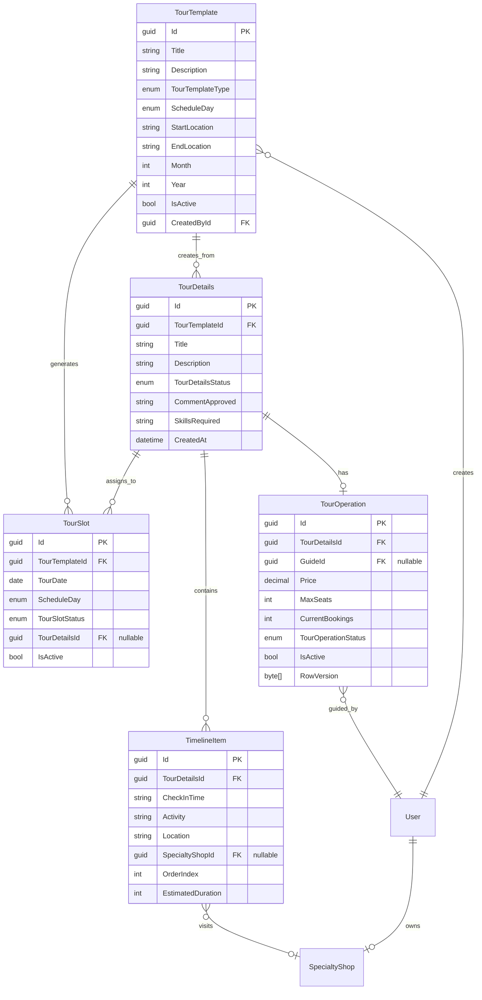
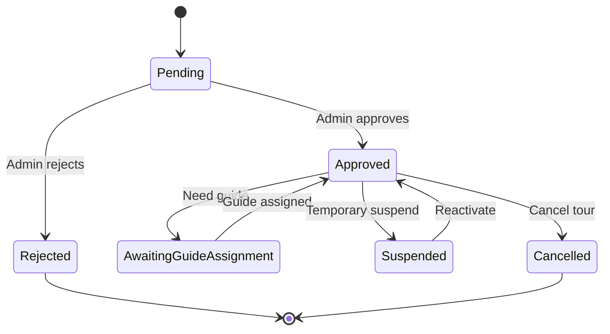
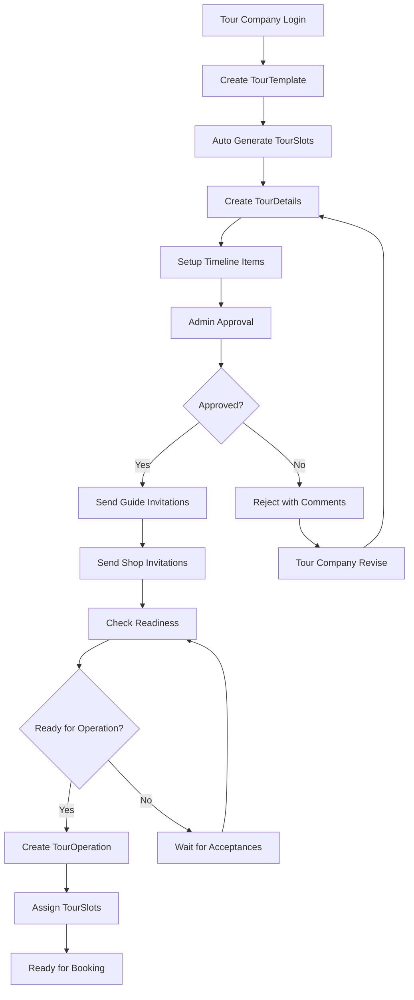
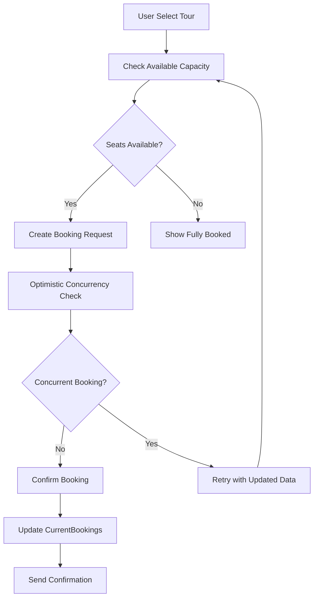
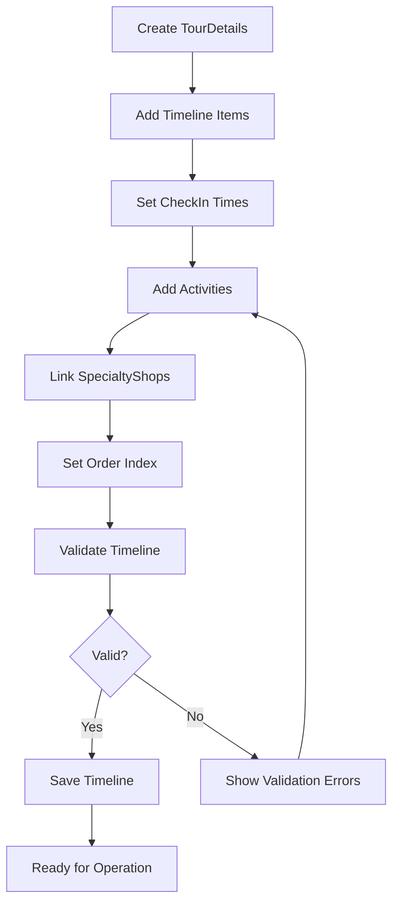
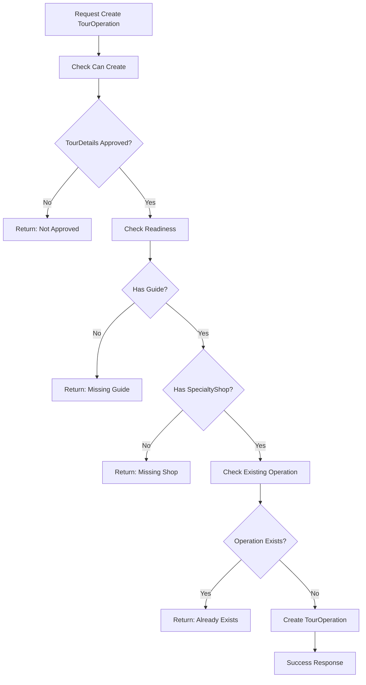
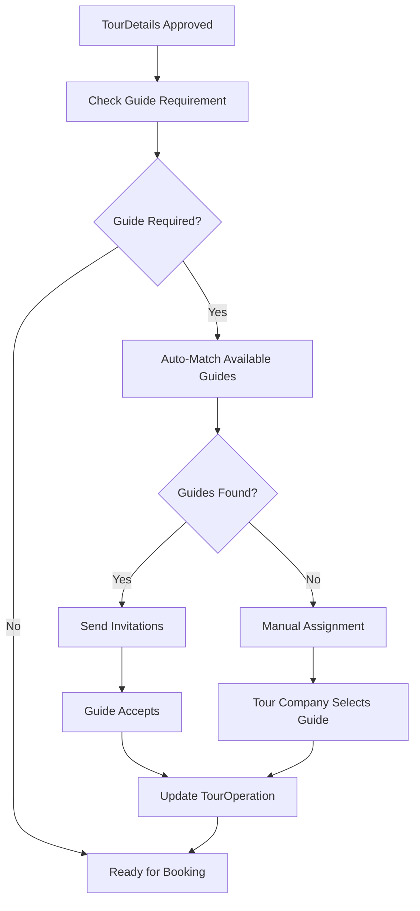

# TayNinhTour - TourDetail System Flow Documentation

## 📋 Table of Contents
- [Overview & Architecture](#overview--architecture)
- [Entity Relationships](#entity-relationships)
- [Business Logic & Rules](#business-logic--rules)
- [API Documentation](#api-documentation)
- [Workflow Processes](#workflow-processes)
- [Frontend Integration Guide](#frontend-integration-guide)
- [Testing & Examples](#testing--examples)
- [Performance & Security](#performance--security)

---

## 🏗️ Overview & Architecture

### System Overview
TayNinhTour TourDetail System là hệ thống quản lý tour du lịch với kiến trúc 3-layer (Controller → BLL → DAL) sử dụng .NET 8.0, EF Core và MySQL.

### Core Components
- **TourTemplate**: Template cơ bản định nghĩa cấu trúc tour
- **TourSlot**: Các slot thời gian cụ thể được tạo tự động từ template
- **TourDetails**: Lịch trình chi tiết với timeline và specialty shop integration
- **TourOperation**: Thông tin vận hành (guide, pricing, capacity management)

### Technology Stack
- **Framework**: .NET 8.0/ASP.NET Core Web API
- **Database**: MySQL 8.0.21 + EF Core 8.0.15
- **Authentication**: JWT Bearer Token
- **Architecture**: Clean 3-Layer Architecture
- **Documentation**: Swagger/OpenAPI v3

---

## 🔗 Entity Relationships

### Entity Relationship Diagram


### Key Relationships
1. **TourTemplate (1:N) TourSlot**: Template tự động tạo 4 slots/tháng
2. **TourTemplate (1:N) TourDetails**: Một template có thể có nhiều lịch trình chi tiết
3. **TourDetails (1:1) TourOperation**: Mỗi lịch trình có một operation
4. **TourDetails (1:N) TimelineItem**: Lịch trình chứa các hoạt động chi tiết
5. **TourSlot (N:1) TourDetails**: Slots được assign cho lịch trình cụ thể

---

## 📊 Business Logic & Rules

### TourTemplate Rules
- **Types**: Chỉ 2 loại - `FreeScenic` (1) và `PaidAttraction` (2)
- **Schedule**: Chỉ được chọn `Saturday` HOẶC `Sunday` (không được cả hai)
- **Slot Generation**: Tự động tạo tối đa 4 slots/tháng theo thuật toán phân bố tối ưu
- **Permissions**: Chỉ role `Tour Company` mới được tạo/sửa/xóa

### TourDetails Status Flow


### TourOperation Rules
- **Capacity Management**: `CurrentBookings` ≤ `MaxSeats`
- **Concurrency Control**: Sử dụng `RowVersion` để prevent race conditions
- **Price Validation**: Price > 0
- **Guide Assignment**: Optional, có thể assign sau
- **Booking Calculation**: Real-time từ TourBookings với Status = Confirmed

### TourOperation Creation Validation Rules
**Mandatory Requirements:**
1. **TourDetails Status**: Phải có status = `Approved` (đã được admin duyệt)
2. **Guide Requirement**: Phải có ít nhất 1 accepted `TourGuideInvitation`
3. **SpecialtyShop Requirement**: Phải có ít nhất 1 accepted `TourDetailsSpecialtyShop`
4. **Unique Operation**: TourDetails chưa có TourOperation nào

**Validation Endpoints:**
- `GET /api/TourOperation/readiness/{tourDetailsId}` - Kiểm tra đầy đủ requirements
- `GET /api/TourOperation/can-create/{tourDetailsId}` - Kiểm tra có thể tạo operation

**Guide Assignment Options:**
- **Direct Assignment**: Assign trực tiếp guide vào TourOperation
- **Invitation System**: Gửi invitation và chờ guide accept

**SpecialtyShop Integration:**
- **Timeline Integration**: Shop được link qua TimelineItem
- **Invitation System**: Gửi invitation và chờ shop accept

### General Validation Rules
- **Price**: 0 ≤ price ≤ 100,000,000 VND
- **Guests**: 1 ≤ minGuests ≤ maxGuests ≤ 1000
- **Duration**: 1 ≤ duration ≤ 30 days
- **Title**: 1-200 characters
- **Description**: 1-2000 characters

---

## 🚀 API Documentation

### Authentication
Tất cả API endpoints yêu cầu JWT Bearer token:
```http
Authorization: Bearer {your-jwt-token}
```

### Base URL
- **Development**: `http://localhost:5267`
- **Production**: `https://api.tayninhour.com`

### TourTemplate APIs

#### 1. Get Tour Templates
```http
GET /api/TourCompany/template?pageIndex=1&pageSize=10&templateType=FreeScenic&startLocation=TP.HCM
```

**Query Parameters:**
- `pageIndex` (int): Trang hiện tại (1-based, default: 1)
- `pageSize` (int): Số items per page (default: 10)
- `templateType` (string): Filter theo loại tour ("FreeScenic" | "PaidAttraction")
- `startLocation` (string): Filter theo điểm khởi hành
- `includeInactive` (bool): Bao gồm templates không active (default: false)

**Response:**
```json
{
  "statusCode": 200,
  "message": "Lấy danh sách tour templates thành công",
  "data": [
    {
      "id": "template-uuid",
      "title": "Tour Núi Bà Đen",
      "description": "Tour khám phá núi Bà Đen",
      "templateType": "FreeScenic",
      "scheduleDays": "Saturday",
      "startLocation": "TP.HCM",
      "endLocation": "Tây Ninh",
      "month": 6,
      "year": 2025,
      "isActive": true,
      "createdAt": "2025-06-01T00:00:00Z",
      "slotsCount": 4,
      "detailsCount": 2
    }
  ],
  "totalCount": 15,
  "pageIndex": 1,
  "pageSize": 10,
  "totalPages": 2
}
```

#### 2. Create Tour Template
```http
POST /api/TourCompany/template
Authorization: Bearer {tour-company-token}
Content-Type: application/json
```

**Request Body:**
```json
{
  "title": "Tour Núi Bà Đen",
  "description": "Tour khám phá núi Bà Đen với cảnh đẹp thiên nhiên",
  "templateType": "FreeScenic",
  "scheduleDays": "Saturday",
  "startLocation": "TP.HCM",
  "endLocation": "Tây Ninh",
  "month": 6,
  "year": 2025,
  "images": ["image1.jpg", "image2.jpg"]
}
```

**Response (201 Created):**
```json
{
  "statusCode": 201,
  "message": "Tạo tour template thành công",
  "data": {
    "id": "new-template-uuid",
    "title": "Tour Núi Bà Đen",
    "slotsGenerated": 4,
    "nextSlotDates": ["2025-06-07", "2025-06-14", "2025-06-21", "2025-06-28"]
  }
}
```

### TourDetails APIs

#### 1. Get TourDetails by Template
```http
GET /api/TourDetails/template/{templateId}?includeInactive=false
```

**Response:**
```json
{
  "statusCode": 200,
  "message": "Lấy danh sách tour details thành công",
  "data": [
    {
      "id": "detail-uuid",
      "tourTemplateId": "template-uuid",
      "title": "Lịch trình VIP",
      "description": "Lịch trình cao cấp với dịch vụ VIP",
      "status": "Approved",
      "timeline": [
        {
          "id": "timeline-uuid",
          "checkInTime": "05:00",
          "activity": "Khởi hành từ TP.HCM",
          "location": "Bến xe Miền Tây",
          "orderIndex": 1,
          "estimatedDuration": 30,
          "specialtyShop": null
        }
      ],
      "tourOperation": {
        "id": "operation-uuid",
        "price": 500000,
        "maxSeats": 20,
        "currentBookings": 5,
        "availableSeats": 15,
        "guide": {
          "id": "guide-uuid",
          "fullName": "Nguyễn Văn A",
          "phone": "0901234567"
        }
      },
      "assignedSlotsCount": 4,
      "createdAt": "2025-06-01T00:00:00Z"
    }
  ],
  "totalCount": 2
}
```

#### 2. Create TourDetails
```http
POST /api/TourDetails
Authorization: Bearer {tour-company-token}
Content-Type: application/json
```

**Request Body:**
```json
{
  "tourTemplateId": "template-uuid",
  "title": "Lịch trình VIP",
  "description": "Lịch trình cao cấp với các dịch vụ VIP",
  "skillsRequired": "English,Chinese,French",
  "specialtyShopIds": ["shop-uuid-1", "shop-uuid-2"]
}
```

**Response (201 Created):**
```json
{
  "statusCode": 201,
  "message": "Tạo tour details thành công",
  "data": {
    "id": "new-detail-uuid",
    "title": "Lịch trình VIP",
    "status": "Pending",
    "clonedSlotsCount": 4,
    "cloneInfo": "Đã clone 4 slots từ template cho lịch trình này"
  }
}
```

### TourOperation APIs

#### 1. Check TourOperation Readiness
```http
GET /api/TourOperation/readiness/{tourDetailsId}
Authorization: Bearer {token}
```

**Description**: Kiểm tra xem TourDetails có đủ điều kiện để tạo TourOperation public hay không.

**Response (200 OK):**
```json
{
  "tourDetailsId": "detail-uuid",
  "isReady": false,
  "hasTourGuide": false,
  "hasSpecialtyShop": false,
  "acceptedGuideInvitations": 0,
  "acceptedShopInvitations": 0,
  "missingRequirements": [
    "Chưa có hướng dẫn viên được phân công",
    "Chưa có cửa hàng đặc sản tham gia"
  ],
  "message": "Tour cần có đầy đủ hướng dẫn viên và cửa hàng đặc sản trước khi public",
  "guideInfo": {
    "hasDirectAssignment": false,
    "directlyAssignedGuideId": null,
    "directlyAssignedGuideName": null,
    "pendingInvitations": 0,
    "acceptedInvitations": 0,
    "rejectedInvitations": 0,
    "acceptedGuides": []
  },
  "shopInfo": {
    "pendingInvitations": 0,
    "acceptedInvitations": 0,
    "declinedInvitations": 0,
    "acceptedShops": []
  }
}
```

#### 2. Check Can Create TourOperation
```http
GET /api/TourOperation/can-create/{tourDetailsId}
Authorization: Bearer {tour-company-token}
```

**Description**: Kiểm tra xem có thể tạo TourOperation cho TourDetails hay không.

**Response (200 OK):**
```json
{
  "tourDetailsId": "detail-uuid",
  "canCreate": false,
  "message": "TourDetails chưa được admin duyệt",
  "success": true
}
```

**Possible Messages:**
- `"TourDetails không tồn tại"` - TourDetails ID không hợp lệ
- `"TourDetails chưa được admin duyệt"` - Status != Approved
- `"TourOperation đã tồn tại cho TourDetails này"` - Đã có operation
- `"Có thể tạo TourOperation"` - Đủ điều kiện tạo

#### 3. Create TourOperation
```http
POST /api/TourOperation
Authorization: Bearer {tour-company-token}
Content-Type: application/json
```

**Request Body:**
```json
{
  "tourDetailsId": "detail-uuid",
  "price": 500000,
  "maxSeats": 20,
  "guideId": "guide-uuid"
}
```

**Validation Rules:**
- TourDetails phải tồn tại và được approve (Status = Approved)
- TourDetails chưa có TourOperation
- TourDetails phải có ít nhất 1 accepted TourGuideInvitation
- TourDetails phải có ít nhất 1 accepted TourDetailsSpecialtyShop

**Response (200 OK):**
```json
{
  "success": true,
  "message": "Tạo tour operation thành công",
  "operation": {
    "id": "operation-uuid",
    "tourDetailsId": "detail-uuid",
    "price": 500000,
    "maxSeats": 20,
    "currentBookings": 0,
    "availableSeats": 20,
    "status": "Scheduled",
    "guide": {
      "id": "guide-uuid",
      "fullName": "Nguyễn Văn A",
      "phone": "0901234567"
    }
  }
}
```

**Error Response (400 Bad Request):**
```json
{
  "success": false,
  "message": "Tour cần có đầy đủ hướng dẫn viên và cửa hàng đặc sản trước khi public",
  "validationErrors": [
    "Chưa có hướng dẫn viên được phân công",
    "Chưa có cửa hàng đặc sản tham gia"
  ]
}
```

#### 4. Get Operation by TourDetails
```http
GET /api/TourOperation/details/{tourDetailsId}
```

**Response:**
```json
{
  "id": "operation-uuid",
  "tourDetailsId": "detail-uuid",
  "price": 500000,
  "maxSeats": 20,
  "bookedSeats": 5,
  "availableSeats": 15,
  "status": "Scheduled",
  "isActive": true,
  "guide": {
    "id": "guide-uuid",
    "fullName": "Nguyễn Văn A",
    "phone": "0901234567",
    "email": "guide@example.com"
  },
  "createdAt": "2025-06-01T00:00:00Z"
}
```

---

## 🔄 Workflow Processes

### 1. Tour Creation Flow


### 2. Booking & Capacity Management Flow


### 3. Timeline Management Flow


### 4. TourOperation Validation Flow


### 5. Guide Assignment Flow


---

## 💻 Frontend Integration Guide

### Authentication Setup
```javascript
// Setup axios with JWT token
const api = axios.create({
  baseURL: 'http://localhost:5267/api',
  headers: {
    'Authorization': `Bearer ${localStorage.getItem('jwt_token')}`,
    'Content-Type': 'application/json'
  }
});

// Test credentials
const testCredentials = {
  email: 'tourcompany@gmail.com',
  password: '12345678h@',
  role: 'Tour Company'
};
```

### Common API Patterns

#### 1. Pagination Handling
```javascript
const getTourTemplates = async (page = 1, size = 10, filters = {}) => {
  try {
    const params = new URLSearchParams({
      pageIndex: page,
      pageSize: size,
      ...filters
    });

    const response = await api.get(`/TourCompany/template?${params}`);
    return {
      data: response.data.data,
      totalCount: response.data.totalCount,
      totalPages: response.data.totalPages,
      currentPage: response.data.pageIndex
    };
  } catch (error) {
    handleApiError(error);
  }
};
```

#### 2. Error Handling
```javascript
const handleApiError = (error) => {
  if (error.response) {
    const { status, data } = error.response;

    switch (status) {
      case 400:
        // Validation errors
        if (data.validationErrors) {
          showValidationErrors(data.validationErrors);
        } else {
          showError(data.message || 'Dữ liệu không hợp lệ');
        }
        break;
      case 401:
        // Unauthorized - redirect to login
        redirectToLogin();
        break;
      case 403:
        // Forbidden - insufficient permissions
        showError('Bạn không có quyền thực hiện thao tác này');
        break;
      case 404:
        showError('Không tìm thấy dữ liệu');
        break;
      case 500:
        showError('Lỗi hệ thống, vui lòng thử lại sau');
        break;
      default:
        showError('Có lỗi xảy ra, vui lòng thử lại');
    }
  } else {
    showError('Không thể kết nối đến server');
  }
};
```

#### 3. TourOperation Validation Checks
```javascript
const checkTourOperationReadiness = async (tourDetailsId) => {
  try {
    const response = await api.get(`/TourOperation/readiness/${tourDetailsId}`);
    const readiness = response.data;

    return {
      isReady: readiness.isReady,
      hasTourGuide: readiness.hasTourGuide,
      hasSpecialtyShop: readiness.hasSpecialtyShop,
      missingRequirements: readiness.missingRequirements,
      guideInfo: readiness.guideInfo,
      shopInfo: readiness.shopInfo
    };
  } catch (error) {
    handleApiError(error);
    return null;
  }
};

const checkCanCreateOperation = async (tourDetailsId) => {
  try {
    const response = await api.get(`/TourOperation/can-create/${tourDetailsId}`);
    return {
      canCreate: response.data.canCreate,
      message: response.data.message
    };
  } catch (error) {
    handleApiError(error);
    return { canCreate: false, message: 'Lỗi kiểm tra điều kiện' };
  }
};

// UI Helper for validation display
const displayValidationStatus = (readiness) => {
  const statusContainer = document.getElementById('validation-status');

  if (readiness.isReady) {
    statusContainer.innerHTML = `
      <div class="alert alert-success">
        <i class="fas fa-check-circle"></i>
        Tour đã sẵn sàng để tạo operation
      </div>
    `;
  } else {
    const requirementsList = readiness.missingRequirements
      .map(req => `<li>${req}</li>`)
      .join('');

    statusContainer.innerHTML = `
      <div class="alert alert-warning">
        <i class="fas fa-exclamation-triangle"></i>
        <p>Tour chưa sẵn sàng. Cần hoàn thành:</p>
        <ul>${requirementsList}</ul>
      </div>
    `;
  }
};
```

#### 4. Real-time Capacity Updates
```javascript
const checkTourCapacity = async (operationId) => {
  try {
    const response = await api.get(`/TourOperation/${operationId}`);
    const operation = response.data;

    return {
      maxSeats: operation.maxSeats,
      bookedSeats: operation.bookedSeats,
      availableSeats: operation.availableSeats,
      isFullyBooked: operation.bookedSeats >= operation.maxSeats
    };
  } catch (error) {
    handleApiError(error);
    return null;
  }
};

// Update UI with capacity info
const updateCapacityDisplay = (capacity) => {
  const progressBar = document.getElementById('capacity-progress');
  const percentage = (capacity.bookedSeats / capacity.maxSeats) * 100;

  progressBar.style.width = `${percentage}%`;
  progressBar.textContent = `${capacity.bookedSeats}/${capacity.maxSeats}`;

  if (capacity.isFullyBooked) {
    progressBar.classList.add('fully-booked');
  }
};
```

#### 4. Form Validation
```javascript
const validateTourTemplateForm = (formData) => {
  const errors = {};

  // Title validation
  if (!formData.title || formData.title.trim().length === 0) {
    errors.title = 'Tiêu đề là bắt buộc';
  } else if (formData.title.length > 200) {
    errors.title = 'Tiêu đề không được vượt quá 200 ký tự';
  }

  // Template type validation
  if (!formData.templateType) {
    errors.templateType = 'Vui lòng chọn loại tour';
  } else if (!['FreeScenic', 'PaidAttraction'].includes(formData.templateType)) {
    errors.templateType = 'Loại tour không hợp lệ';
  }

  // Schedule day validation
  if (!formData.scheduleDays) {
    errors.scheduleDays = 'Vui lòng chọn ngày trong tuần';
  } else if (!['Saturday', 'Sunday'].includes(formData.scheduleDays)) {
    errors.scheduleDays = 'Chỉ được chọn Thứ 7 hoặc Chủ nhật';
  }

  // Month/Year validation
  const currentYear = new Date().getFullYear();
  if (!formData.year || formData.year < currentYear || formData.year > currentYear + 5) {
    errors.year = `Năm phải từ ${currentYear} đến ${currentYear + 5}`;
  }

  if (!formData.month || formData.month < 1 || formData.month > 12) {
    errors.month = 'Tháng phải từ 1 đến 12';
  }

  return {
    isValid: Object.keys(errors).length === 0,
    errors
  };
};
```

---

## 🧪 Testing & Examples

### Test Credentials
```
Email: tourcompany@gmail.com
Password: 12345678h@
Role: Tour Company
```

### Sample cURL Commands

#### 1. Login to get JWT token
```bash
curl -X POST "http://localhost:5267/api/Auth/login" \
  -H "Content-Type: application/json" \
  -d '{
    "email": "tourcompany@gmail.com",
    "password": "12345678h@"
  }'
```

#### 2. Create Tour Template
```bash
curl -X POST "http://localhost:5267/api/TourCompany/template" \
  -H "Authorization: Bearer YOUR_JWT_TOKEN" \
  -H "Content-Type: application/json" \
  -d '{
    "title": "Tour Núi Bà Đen",
    "description": "Tour khám phá núi Bà Đen",
    "templateType": "FreeScenic",
    "scheduleDays": "Saturday",
    "startLocation": "TP.HCM",
    "endLocation": "Tây Ninh",
    "month": 6,
    "year": 2025,
    "images": ["image1.jpg"]
  }'
```

#### 3. Create Tour Details
```bash
curl -X POST "http://localhost:5267/api/TourDetails" \
  -H "Authorization: Bearer YOUR_JWT_TOKEN" \
  -H "Content-Type: application/json" \
  -d '{
    "tourTemplateId": "TEMPLATE_UUID",
    "title": "Lịch trình VIP",
    "description": "Lịch trình cao cấp",
    "skillsRequired": "English,Chinese"
  }'
```

#### 4. Check TourOperation Readiness
```bash
curl -X GET "http://localhost:5267/api/TourOperation/readiness/DETAILS_UUID" \
  -H "Authorization: Bearer YOUR_JWT_TOKEN"
```

#### 5. Check Can Create TourOperation
```bash
curl -X GET "http://localhost:5267/api/TourOperation/can-create/DETAILS_UUID" \
  -H "Authorization: Bearer YOUR_JWT_TOKEN"
```

#### 6. Create Tour Operation
```bash
curl -X POST "http://localhost:5267/api/TourOperation" \
  -H "Authorization: Bearer YOUR_JWT_TOKEN" \
  -H "Content-Type: application/json" \
  -d '{
    "tourDetailsId": "DETAILS_UUID",
    "price": 500000,
    "maxSeats": 20
  }'
```

### Common Use Cases

#### 1. Complete Tour Setup Flow with Validation
```javascript
const setupCompleteTour = async () => {
  try {
    // Step 1: Create template
    const template = await createTourTemplate({
      title: "Tour Núi Bà Đen",
      templateType: "FreeScenic",
      scheduleDays: "Saturday",
      startLocation: "TP.HCM",
      endLocation: "Tây Ninh",
      month: 6,
      year: 2025
    });

    // Step 2: Create details
    const details = await createTourDetails({
      tourTemplateId: template.id,
      title: "Lịch trình VIP",
      description: "Lịch trình cao cấp với dịch vụ VIP"
    });

    // Step 3: Add timeline items
    await addTimelineItem({
      tourDetailsId: details.id,
      checkInTime: "05:00",
      activity: "Khởi hành từ TP.HCM",
      location: "Bến xe Miền Tây",
      orderIndex: 1
    });

    // Step 4: Wait for admin approval (manual step)
    console.log('Waiting for admin approval...');

    // Step 5: Check if can create operation
    const canCreate = await checkCanCreateOperation(details.id);
    if (!canCreate.canCreate) {
      throw new Error(`Cannot create operation: ${canCreate.message}`);
    }

    // Step 6: Check readiness (guide and shop requirements)
    const readiness = await checkTourOperationReadiness(details.id);
    if (!readiness.isReady) {
      console.warn('Tour not ready for operation:', readiness.missingRequirements);

      // Handle missing requirements
      if (!readiness.hasTourGuide) {
        console.log('Sending guide invitations...');
        // await sendGuideInvitations(details.id);
      }

      if (!readiness.hasSpecialtyShop) {
        console.log('Sending shop invitations...');
        // await sendShopInvitations(details.id);
      }

      throw new Error('Tour not ready: ' + readiness.missingRequirements.join(', '));
    }

    // Step 7: Create operation (only if all validations pass)
    const operation = await createTourOperation({
      tourDetailsId: details.id,
      price: 500000,
      maxSeats: 20
    });

    console.log('Tour setup completed successfully:', {
      template: template.id,
      details: details.id,
      operation: operation.id,
      readiness: readiness
    });

    return {
      success: true,
      template,
      details,
      operation
    };

  } catch (error) {
    console.error('Tour setup failed:', error);
    return {
      success: false,
      error: error.message
    };
  }
};
```

---

## ⚡ Performance & Security

### Performance Considerations

#### 1. Database Optimization
- **Indexes**: Tạo indexes cho các trường thường query (TourTemplateId, Status, CreatedAt)
- **Eager Loading**: Sử dụng Include() cho related entities khi cần thiết
- **Pagination**: Luôn sử dụng pagination cho danh sách lớn
- **Caching**: Cache tour templates và operation details (không cache capacity)

#### 2. Concurrency Control
```csharp
// Optimistic concurrency cho booking
public async Task<bool> CreateBookingAsync(CreateBookingRequest request)
{
    using var transaction = await _context.Database.BeginTransactionAsync();
    try
    {
        var operation = await _context.TourOperations
            .FirstOrDefaultAsync(x => x.Id == request.TourOperationId);

        if (operation.CurrentBookings + request.GuestCount > operation.MaxSeats)
        {
            return false; // Not enough capacity
        }

        // Update with row version check
        operation.CurrentBookings += request.GuestCount;
        await _context.SaveChangesAsync(); // Will throw if RowVersion changed

        await transaction.CommitAsync();
        return true;
    }
    catch (DbUpdateConcurrencyException)
    {
        await transaction.RollbackAsync();
        return false; // Concurrent update detected
    }
}
```

### Security Best Practices

#### 1. Authentication & Authorization
- **JWT Validation**: Validate token signature, expiration, issuer
- **Role-based Access**: Enforce role permissions at controller level
- **Ownership Validation**: Users can only modify their own resources

#### 2. Input Validation
- **DTO Validation**: Use DataAnnotations for input validation
- **Business Rules**: Validate business logic in service layer
- **SQL Injection Prevention**: EF Core parameterized queries (automatic)

#### 3. Error Handling
- **Sensitive Information**: Don't expose internal errors to clients
- **Logging**: Log all errors with context for debugging
- **Rate Limiting**: Implement rate limiting for API endpoints

---

## 📞 Support & Resources

### API Documentation
- **Swagger UI**: `http://localhost:5267/swagger`
- **OpenAPI Spec**: Available in project documentation

### Database Schema
- **Migrations**: Located in `TayNinhTourApi.DataAccessLayer/Migrations/`
- **Entity Configurations**: Located in `TayNinhTourApi.DataAccessLayer/EntityConfigurations/`

### Business Logic
- **Services**: Located in `TayNinhTourApi.BusinessLogicLayer/Services/`
- **DTOs**: Located in `TayNinhTourApi.BusinessLogicLayer/DTOs/`

### Contact
- **Email**: support@tayninhour.com
- **Documentation**: Check project README files for detailed implementation guides

---

**Last Updated**: June 25, 2025
**Version**: 1.1 - Added TourOperation Validation Endpoints
**Author**: TayNinhTour Development Team

## 🆕 Recent Updates (v1.1)

### New Validation Endpoints
- **`GET /api/TourOperation/readiness/{tourDetailsId}`** - Comprehensive readiness check
- **`GET /api/TourOperation/can-create/{tourDetailsId}`** - Pre-creation validation

### Enhanced Business Rules
- **Mandatory Guide Requirement**: TourOperation requires accepted guide invitation
- **Mandatory SpecialtyShop Requirement**: TourOperation requires accepted shop invitation
- **Admin Approval Requirement**: TourDetails must be approved before operation creation

### Updated Workflows
- **Tour Creation Flow**: Now includes validation steps
- **TourOperation Validation Flow**: New dedicated validation workflow
- **Frontend Integration**: Added validation check examples
