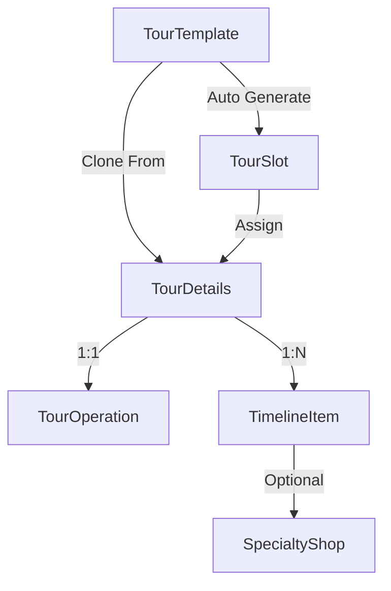

# 🎯 TourTemplate Flow Guide & API Integration

## 📋 Tổng Quan Hệ Thống

TayNinhTour sử dụng kiến trúc **Template-Based Tour Management** với flow tự động hóa cao:

```
TourTemplate → Auto TourSlots → TourDetails → TourOperation + Timeline
```

### 🔗 Mối Quan Hệ Chính



---

## 🚀 Flow Chính của TourTemplate

### 1️⃣ **TourTemplate Creation Flow**

**Bước 1: Tạo Template**
- Tour Company tạo template với thông tin cơ bản
- Hệ thống **tự động generate TourSlots** cho tháng/năm đã chọn
- Slots được tạo theo `ScheduleDays` (chỉ được chọn Thứ 7=6 hoặc Chủ nhật=0)

**Bước 2: Auto-Generation**
```javascript
// Khi tạo template thành công
POST /api/TourCompany/template
→ Template được tạo
→ Auto generate 4-5 TourSlots cho tháng
→ Response bao gồm thông tin slots đã tạo
```

### 2️⃣ **TourDetails Creation Flow**

**Bước 1: Clone từ Template**
- Tour Company tạo TourDetails từ template
- Hệ thống **auto-clone tất cả TourSlots** từ template
- Tạo relationship TourSlots → TourDetails

**Bước 2: Timeline Management**
- Tạo timeline items cho lịch trình chi tiết
- Tích hợp với SpecialtyShop (optional)
- Sắp xếp theo thời gian và SortOrder

**Bước 3: Operation Setup**
- Tạo TourOperation (1:1 với TourDetails)
- Assign guide, pricing, capacity
- Set trạng thái hoạt động

---

## 🔧 API Endpoints cho Frontend

### **TourTemplate APIs**

#### 1. Lấy Danh Sách Templates
```http
GET /api/TourCompany/template?pageIndex=1&pageSize=10&templateType=FreeScenic&startLocation=TP.HCM&includeInactive=false
```

**Response:**
```json
{
  "statusCode": 200,
  "message": "Lấy danh sách tour templates thành công",
  "success": true,
  "data": {
    "items": [
      {
        "id": "guid",
        "title": "Tour Núi Bà Đen",
        "templateType": "FreeScenic",
        "scheduleDays": "Saturday",
        "startLocation": "TP.HCM",
        "endLocation": "Tây Ninh",
        "month": 6,
        "year": 2025,
        "isActive": true,
        "images": ["image1.jpg"],
        "createdAt": "2025-06-24T10:00:00Z",
        "capacitySummary": {
          "totalSlots": 5,
          "availableSlots": 3,
          "totalCapacity": 100
        }
      }
    ],
    "totalCount": 25,
    "pageIndex": 0,
    "pageSize": 10
  }
}
```

#### 2. Tạo Template Mới
```http
POST /api/TourCompany/template
Content-Type: application/json
Authorization: Bearer {jwt-token}
```

**Request Body:**
```json
{
  "title": "Tour Núi Bà Đen VIP",
  "startLocation": "TP.HCM",
  "endLocation": "Tây Ninh",
  "templateType": 1,
  "scheduleDays": 6,
  "month": 7,
  "year": 2025,
  "images": ["image1.jpg", "image2.jpg"]
}
```

**⚠️ Lưu ý**:
- `templateType`: Sử dụng số nguyên (1 = FreeScenic, 2 = PaidAttraction)
- `scheduleDays`: Chỉ được dùng 0 (Sunday) hoặc 6 (Saturday)
- Không có trường `description` trong RequestCreateTourTemplateDto
- Validation sẽ reject nếu chọn Monday-Friday (1-5)

**Response:**
```json
{
  "statusCode": 201,
  "message": "Tạo tour template thành công và đã tạo 5 slots cho tháng 7/2025",
  "success": true,
  "data": {
    "id": "new-template-guid",
    "title": "Tour Núi Bà Đen VIP",
    "templateType": "FreeScenic",
    "scheduleDays": "Saturday",
    "startLocation": "TP.HCM",
    "endLocation": "Tây Ninh",
    "month": 7,
    "year": 2025,
    "isActive": true,
    "images": ["image1.jpg", "image2.jpg"],
    "createdBy": null,
    "updatedBy": null,
    "createdAt": "2025-06-24T10:00:00Z",
    "updatedAt": null,
    "capacitySummary": null
  }
}
```

#### 3. Cập Nhật Template
```http
PATCH /api/TourCompany/template/{id}
```

**Request Body:**
```json
{
  "title": "Tour Núi Bà Đen VIP - Updated",
  "templateType": 2,
  "scheduleDays": 0,
  "startLocation": "TP.HCM - Cập nhật",
  "endLocation": "Tây Ninh - Cập nhật",
  "images": ["new-image1.jpg"]
}
```

#### 4. Xóa Template
```http
DELETE /api/TourCompany/template/{id}
```

**Response:**
```json
{
  "statusCode": 200,
  "message": "Xóa tour template thành công",
  "success": true
}
```

### **TourDetails APIs**

#### 1. Tạo TourDetails từ Template
```http
POST /api/TourCompany/details
```

**Request Body:**
```json
{
  "tourTemplateId": "template-guid",
  "title": "Lịch trình VIP Núi Bà Đen",
  "description": "Lịch trình cao cấp với dịch vụ VIP",
  "skillsRequired": "Tiếng Anh, Lịch sử địa phương"
}
```

**Response:**
```json
{
  "statusCode": 201,
  "message": "Tạo tour details thành công và đã clone 5 TourSlots",
  "success": true,
  "data": {
    "id": "details-guid",
    "title": "Lịch trình VIP Núi Bà Đen",
    "description": "Lịch trình cao cấp với dịch vụ VIP",
    "status": 0,
    "commentApproved": null,
    "skillsRequired": "Tiếng Anh, Lịch sử địa phương",
    "tourTemplateId": "template-guid",
    "createdAt": "2025-06-24T10:05:00Z",
    "updatedAt": null
  }
}
```

#### 2. Lấy Chi Tiết TourDetails
```http
GET /api/TourCompany/details/{id}
```

**Response:**
```json
{
  "statusCode": 200,
  "data": {
    "id": "details-guid",
    "title": "Lịch trình VIP Núi Bà Đen",
    "description": "Lịch trình cao cấp",
    "status": 1,
    "commentApproved": null,
    "skillsRequired": "Tiếng Anh, Lịch sử địa phương",
    "tourTemplateId": "template-guid",
    "tourTemplate": {
      "id": "template-guid",
      "title": "Tour Núi Bà Đen",
      "templateType": 1,
      "scheduleDays": 6
    },
    "tourOperation": {
      "id": "operation-guid",
      "guideId": "guide-guid",
      "price": 500000,
      "maxSeats": 20,
      "status": 1,
      "description": null,
      "notes": null,
      "isActive": true
    },
    "timeline": [
      {
        "id": "timeline-1",
        "tourDetailsId": "details-guid",
        "checkInTime": "05:00",
        "activity": "Khởi hành từ TP.HCM",
        "specialtyShopId": null,
        "sortOrder": 1,
        "specialtyShop": null,
        "createdAt": "2025-06-24T10:00:00Z",
        "updatedAt": null
      },
      {
        "id": "timeline-2",
        "tourDetailsId": "details-guid",
        "checkInTime": "09:00",
        "activity": "Ghé shop bánh tráng",
        "specialtyShopId": "shop-guid",
        "sortOrder": 2,
        "specialtyShop": {
          "id": "shop-guid",
          "shopName": "Shop Bánh Tráng Tây Ninh",
          "location": "Tây Ninh",
          "isShopActive": true
        },
        "createdAt": "2025-06-24T10:05:00Z",
        "updatedAt": null
      }
    ],
    "assignedSlots": [
      {
        "id": "slot-1",
        "tourTemplateId": "template-guid",
        "tourDate": "2025-07-05",
        "scheduleDay": 6,
        "status": 1,
        "tourDetailsId": "details-guid",
        "isActive": true,
        "createdAt": "2025-06-24T10:00:00Z",
        "updatedAt": null
      }
    ]
  }
}
```

### **Timeline Management APIs**

#### 1. Tạo Timeline Item
```http
POST /api/TourCompany/details/timeline
```

**Request Body:**
```json
{
  "tourDetailsId": "details-guid",
  "checkInTime": "10:00",
  "activity": "Tham quan chùa Bà Đen",
  "sortOrder": 3
}
```

#### 2. Tạo Nhiều Timeline Items
```http
POST /api/TourCompany/details/timeline/batch
```

**Request Body:**
```json
{
  "tourDetailsId": "details-guid",
  "timelineItems": [
    {
      "checkInTime": "07:00",
      "activity": "Ăn sáng",
      "sortOrder": 2
    },
    {
      "checkInTime": "08:00", 
      "activity": "Khởi hành đến Núi Bà",
      "sortOrder": 3
    }
  ]
}
```

---

## 💡 Frontend Integration Tips

### 1. **State Management**
```javascript
// Recommended state structure
const tourState = {
  templates: [],
  currentTemplate: null,
  tourDetails: [],
  currentDetails: null,
  timeline: [],
  loading: false,
  error: null
}
```

### 2. **API Call Patterns**
```javascript
// Create template with auto-slot generation
const createTemplate = async (templateData) => {
  try {
    const response = await api.post('/api/TourCompany/template', templateData);
    // Response includes auto-generated slots info
    console.log(`Created ${response.data.autoGeneratedSlots} slots`);
    return response.data;
  } catch (error) {
    handleApiError(error);
  }
};

// Create details with auto-cloning
const createTourDetails = async (detailsData) => {
  try {
    const response = await api.post('/api/TourCompany/details', detailsData);
    // Response includes cloned slots info
    console.log(`Cloned ${response.data.clonedSlotsCount} slots`);
    return response.data;
  } catch (error) {
    handleApiError(error);
  }
};
```

### 3. **Error Handling**
```javascript
const handleApiError = (error) => {
  if (error.response?.status === 400) {
    // Validation errors
    const validationErrors = error.response.data.validationErrors;
    showValidationErrors(validationErrors);
  } else if (error.response?.status === 403) {
    // Permission denied
    showPermissionError();
  } else {
    // General error
    showGeneralError(error.message);
  }
};
```

### 4. **Real-time Updates**
```javascript
// Listen for template/details updates
const subscribeToUpdates = () => {
  // WebSocket or polling for status changes
  socket.on('tourDetailsStatusChanged', (data) => {
    updateTourDetailsStatus(data.id, data.status);
  });
  
  socket.on('slotsGenerated', (data) => {
    refreshTemplateSlots(data.templateId);
  });
};
```

---

## ⚠️ Lưu Ý Quan Trọng

### **Enum Values**
1. **TourTemplateType**: Chỉ có 2 loại
   - `FreeScenic = 1`: Tour danh lam thắng cảnh (miễn phí vào cửa)
   - `PaidAttraction = 2`: Tour khu vui chơi (có phí vào cửa)

2. **ScheduleDay**: Chỉ được chọn **Thứ 7 hoặc Chủ nhật**
   - `Sunday = 0` (Chủ nhật) ✅
   - `Saturday = 6` (Thứ bảy) ✅
   - **KHÔNG** được chọn Monday-Friday (1-5)
   - **KHÔNG** được chọn nhiều ngày cùng lúc

3. **Status Values**: Sử dụng số nguyên, không phải string
   - TourDetailsStatus: `Pending = 0`, `Approved = 1`, etc.
   - TourSlotStatus: `Available = 1`, `FullyBooked = 2`, etc.
   - TourOperationStatus: `Scheduled = 1`, `InProgress = 2`, etc.

### **API Behavior**
4. **Auto-Generation**: Khi tạo template, slots được tự động tạo
5. **Auto-Cloning**: Khi tạo details, slots được tự động clone
6. **Permission**: Chỉ owner mới có thể modify template/details
7. **Timeline Order**: Sử dụng SortOrder và CheckInTime để sắp xếp
8. **SpecialtyShop Integration**: Optional trong timeline items (dùng specialtyShopId)

### **Validation Error Examples**

**Khi chọn ngày không hợp lệ:**
```json
{
  "statusCode": 400,
  "message": "Dữ liệu không hợp lệ",
  "success": false,
  "validationErrors": [
    "Chỉ được chọn Thứ 7 (Saturday) hoặc Chủ nhật (Sunday) cho tour template"
  ],
  "fieldErrors": {
    "ScheduleDays": [
      "Chỉ được chọn Thứ 7 (Saturday) hoặc Chủ nhật (Sunday) cho tour template"
    ]
  }
}
```

**Request gây lỗi (chọn Monday = 1):**
```json
{
  "title": "Tour Test",
  "startLocation": "TP.HCM",
  "endLocation": "Tây Ninh",
  "templateType": 1,
  "scheduleDays": 1,  // ❌ Monday không được phép
  "month": 7,
  "year": 2025
}
```

---

## 🔄 Workflow Tổng Thể

```
1. Tour Company tạo TourTemplate
   ↓ (Auto-generate slots)
2. TourSlots được tạo tự động
   ↓ (Create details)
3. TourDetails được tạo từ template
   ↓ (Auto-clone slots)
4. TourSlots được clone cho details
   ↓ (Add timeline)
5. Timeline items được thêm vào
   ↓ (Setup operation)
6. TourOperation được cấu hình
   ↓ (Ready for booking)
7. Tour sẵn sàng cho khách đặt
```

---

## 📊 Enums & Constants

### **TourTemplateType**
```javascript
const TourTemplateType = {
  FreeScenic: 1,                      // Tour danh lam thắng cảnh (miễn phí vào cửa)
  PaidAttraction: 2                   // Tour khu vui chơi (có phí vào cửa)
};
```

### **ScheduleDay**
```javascript
const ScheduleDay = {
  Sunday: 0,                          // Chủ nhật ✅ Được phép
  Saturday: 6                         // Thứ bảy ✅ Được phép
};

// Các ngày KHÔNG được phép (sẽ bị validation error):
const NotAllowedDays = {
  Monday: 1,                          // Thứ hai ❌
  Tuesday: 2,                         // Thứ ba ❌
  Wednesday: 3,                       // Thứ tư ❌
  Thursday: 4,                        // Thứ năm ❌
  Friday: 5                           // Thứ sáu ❌
};
```
**⚠️ Lưu ý quan trọng**:
- Chỉ được chọn **Thứ 7 (Saturday = 6)** hoặc **Chủ nhật (Sunday = 0)**
- Không được chọn các ngày trong tuần (Monday-Friday)
- Chỉ được chọn **MỘT** ngày duy nhất, không thể chọn nhiều ngày

### **TourSlotStatus**
```javascript
const TourSlotStatus = {
  Available: 1,                       // Slot có sẵn để booking
  FullyBooked: 2,                     // Slot đã được booking đầy
  Cancelled: 3,                       // Slot bị hủy (do thời tiết, bảo trì, etc.)
  Completed: 4,                       // Slot đã hoàn thành
  InProgress: 5                       // Slot đang trong quá trình thực hiện
};
```

### **TourDetailsStatus**
```javascript
const TourDetailsStatus = {
  Pending: 0,                         // Chờ duyệt
  Approved: 1,                        // Đã được duyệt
  Rejected: 2,                        // Bị từ chối
  Suspended: 3,                       // Tạm ngưng
  AwaitingGuideAssignment: 4,         // Chờ phân công hướng dẫn viên
  Cancelled: 5,                       // Đã hủy
  AwaitingAdminApproval: 6            // Chờ admin duyệt
};
```

### **TourOperationStatus**
```javascript
const TourOperationStatus = {
  Scheduled: 1,                       // Operation đã được lên lịch và sẵn sàng
  InProgress: 2,                      // Operation đang được thực hiện
  Completed: 3,                       // Operation đã hoàn thành thành công
  Cancelled: 4,                       // Operation bị hủy
  Postponed: 5,                       // Operation bị hoãn
  PendingConfirmation: 6              // Operation đang chờ xác nhận từ guide
};
```

---

## ✅ Validation Rules

### **TourTemplate Validation**
```javascript
const templateValidation = {
  title: {
    required: true,
    maxLength: 200,
    message: "Vui lòng nhập tên template (không quá 200 ký tự)"
  },
  templateType: {
    required: true,
    enum: [1, 2], // FreeScenic = 1, PaidAttraction = 2
    message: "Vui lòng chọn thể loại tour"
  },
  scheduleDays: {
    required: true,
    enum: [0, 6], // Chỉ Sunday=0 hoặc Saturday=6
    message: "Vui lòng chọn thứ (chỉ được chọn Thứ 7 hoặc Chủ nhật)"
  },
  startLocation: {
    required: true,
    maxLength: 500,
    message: "Vui lòng nhập điểm bắt đầu (không quá 500 ký tự)"
  },
  endLocation: {
    required: true,
    maxLength: 500,
    message: "Vui lòng nhập điểm kết thúc (không quá 500 ký tự)"
  },
  month: {
    required: true,
    min: 1,
    max: 12,
    message: "Tháng phải từ 1 đến 12"
  },
  year: {
    required: true,
    min: 2024,
    max: 2030,
    message: "Năm phải từ 2024 đến 2030"
  },
  images: {
    required: false,
    type: "array",
    message: "Danh sách hình ảnh (tùy chọn)"
  }
};
```

### **Timeline Validation**
```javascript
const timelineValidation = {
  checkInTime: {
    required: true,
    pattern: /^([0-1]?[0-9]|2[0-3]):[0-5][0-9]$/,
    message: "Thời gian phải theo định dạng HH:mm (00:00-23:59)"
  },
  activity: {
    required: true,
    maxLength: 255,
    message: "Hoạt động là bắt buộc và không quá 255 ký tự"
  },
  sortOrder: {
    min: 1,
    message: "Thứ tự phải lớn hơn 0"
  }
};
```

---

## 🎨 UI/UX Recommendations

### **Template Creation Form**
```javascript
const TemplateForm = () => {
  const [formData, setFormData] = useState({
    title: '',
    templateType: '',
    scheduleDays: '',
    startLocation: '',
    endLocation: '',
    month: new Date().getMonth() + 1,
    year: new Date().getFullYear(),
    images: []
  });

  const handleSubmit = async (e) => {
    e.preventDefault();

    // Validate form
    const errors = validateTemplate(formData);
    if (errors.length > 0) {
      setValidationErrors(errors);
      return;
    }

    // Submit with loading state
    setLoading(true);
    try {
      const result = await createTemplate(formData);
      showSuccess(`Template created with ${result.autoGeneratedSlots} slots`);
      navigate('/templates');
    } catch (error) {
      handleApiError(error);
    } finally {
      setLoading(false);
    }
  };

  return (
    <form onSubmit={handleSubmit}>
      {/* Form fields */}
    </form>
  );
};
```

### **Timeline Builder Component**
```javascript
const TimelineBuilder = ({ tourDetailsId, timeline, onUpdate }) => {
  const [items, setItems] = useState(timeline || []);

  const addTimelineItem = () => {
    const newItem = {
      checkInTime: '',
      activity: '',
      sortOrder: items.length + 1
    };
    setItems([...items, newItem]);
  };

  const saveTimeline = async () => {
    try {
      const result = await createTimelineItems({
        tourDetailsId,
        timelineItems: items
      });
      onUpdate(result.data);
      showSuccess(`Created ${result.createdCount} timeline items`);
    } catch (error) {
      handleApiError(error);
    }
  };

  return (
    <div className="timeline-builder">
      {items.map((item, index) => (
        <TimelineItemForm
          key={index}
          item={item}
          onChange={(updatedItem) => updateItem(index, updatedItem)}
        />
      ))}
      <button onClick={addTimelineItem}>Add Timeline Item</button>
      <button onClick={saveTimeline}>Save Timeline</button>
    </div>
  );
};
```

---

## 🔍 Debugging & Monitoring

### **API Response Monitoring**
```javascript
// Log API responses for debugging
const apiLogger = (response) => {
  console.group(`API Response: ${response.config.method.toUpperCase()} ${response.config.url}`);
  console.log('Status:', response.status);
  console.log('Data:', response.data);
  console.log('Headers:', response.headers);
  console.groupEnd();
};

// Add to axios interceptor
axios.interceptors.response.use(
  (response) => {
    if (process.env.NODE_ENV === 'development') {
      apiLogger(response);
    }
    return response;
  },
  (error) => {
    console.error('API Error:', error.response?.data || error.message);
    return Promise.reject(error);
  }
);
```

### **Performance Monitoring**
```javascript
// Track API performance
const performanceTracker = {
  startTime: null,

  start(operation) {
    this.startTime = performance.now();
    console.log(`Starting ${operation}...`);
  },

  end(operation) {
    const duration = performance.now() - this.startTime;
    console.log(`${operation} completed in ${duration.toFixed(2)}ms`);
  }
};

// Usage
performanceTracker.start('Create Template');
await createTemplate(data);
performanceTracker.end('Create Template');
```

Hướng dẫn này cung cấp đầy đủ thông tin để FE developer tích hợp với TourTemplate system một cách hiệu quả và chuyên nghiệp.
