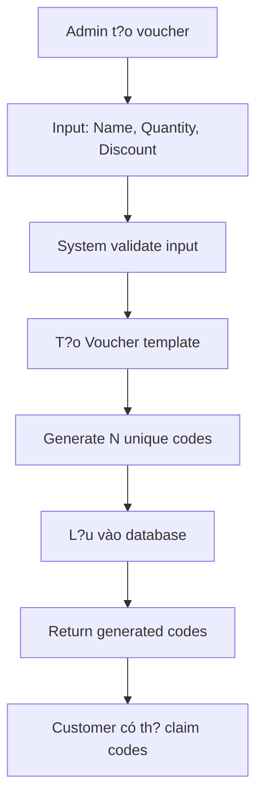

# ?? DEMO REQUEST CHO VOUCHER SYSTEM

## ?? **DTO ?Ã ???C S?A:**

### **CreateVoucherDto (Fixed)**
```json
{
    "name": "Black Friday 2024",
    "quantity": 50,
    "discountAmount": 0,
    "discountPercent": 25,
    "startDate": "2024-11-25T00:00:00Z",
    "endDate": "2024-11-30T23:59:59Z"
}
```

**? ?ã lo?i b? field `code` vì h? th?ng s? t? ??ng generate!**

---

## ?? **TEST REQUESTS:**

### **1. Admin t?o voucher (CORRECTED)**
```http
POST /api/Product/Create-Voucher
Authorization: Bearer {admin-token}
Content-Type: application/json

{
    "name": "T?t Nguyên ?án 2025",
    "quantity": 100,
    "discountAmount": 0,
    "discountPercent": 30,
    "startDate": "2025-01-01T00:00:00Z",
    "endDate": "2025-01-31T23:59:59Z"
}
```

**Expected Response:**
```json
{
    "statusCode": 200,
    "message": "Voucher và các mã voucher ?ã ???c t?o thành công.",
    "success": true,
    "voucherId": "guid-here",
    "generatedCodes": [
        "TETN-X7Y2-1234",
        "TETN-A9B5-5678",
        "TETN-M3N8-9012",
        // ... 97 codes more
    ]
}
```

### **2. Validation Test Cases**

#### **Missing Name:**
```json
{
    "quantity": 10,
    "discountPercent": 20,
    "startDate": "2024-12-01T00:00:00Z",
    "endDate": "2024-12-31T23:59:59Z"
}
```
**Expected:** `400 - Tên voucher là b?t bu?c`

#### **Invalid Quantity:**
```json
{
    "name": "Test Voucher",
    "quantity": 0,
    "discountPercent": 20,
    "startDate": "2024-12-01T00:00:00Z",
    "endDate": "2024-12-31T23:59:59Z"
}
```
**Expected:** `400 - S? l??ng voucher ph?i t? 1 ??n 1000`

#### **Invalid Discount:**
```json
{
    "name": "Test Voucher",
    "quantity": 5,
    "discountAmount": 0,
    "discountPercent": 0,
    "startDate": "2024-12-01T00:00:00Z",
    "endDate": "2024-12-31T23:59:59Z"
}
```
**Expected:** `400 - Ph?i nh?p s? ti?n gi?m ho?c ph?n tr?m gi?m > 0`

#### **Invalid Date Range:**
```json
{
    "name": "Test Voucher",
    "quantity": 5,
    "discountPercent": 20,
    "startDate": "2024-12-31T00:00:00Z",
    "endDate": "2024-12-01T23:59:59Z"
}
```
**Expected:** `400 - Ngày b?t ??u ph?i nh? h?n ngày k?t thúc`

---

## ?? **HO?T ??NG H? TH?NG:**

### **1. Khi Admin g?i request t?o voucher:**
```json
{
    "name": "Summer Sale",
    "quantity": 5,
    "discountPercent": 15,
    "startDate": "2024-06-01T00:00:00Z",
    "endDate": "2024-08-31T23:59:59Z"
}
```

### **2. H? th?ng s?:**
1. **Validate input** theo các rules ?ã ??nh
2. **T?o Voucher entity** v?i thông tin t? DTO
3. **Auto-generate 5 unique codes:**
   - `SUMM-ABC1-2345`
   - `SUMM-DEF6-7890`
   - `SUMM-GHI2-1234`
   - `SUMM-JKL7-5678`
   - `SUMM-MNO3-9012`
4. **L?u vào database:**
   - 1 record trong `Vouchers` table
   - 5 records trong `VoucherCodes` table
5. **Return response** v?i danh sách codes generated

### **3. Database sau khi t?o:**
```sql
-- Vouchers table
SELECT * FROM Vouchers WHERE Name = 'Summer Sale';
-- Id, Name='Summer Sale', Quantity=5, DiscountPercent=15, ...

-- VoucherCodes table  
SELECT * FROM VoucherCodes WHERE VoucherId = '{voucher-id}';
-- 5 records v?i Code khác nhau, IsClaimed=0, IsUsed=0
```

---

## ?? **BENEFITS C?A VI?C S?A NÀY:**

### **1. User Experience T?t H?n:**
- ? Admin ch? c?n nh?p tên và s? l??ng
- ? Không ph?i lo ngh? v? vi?c t?o codes unique
- ? Không risk duplicate codes

### **2. System Design S?ch H?n:**
- ? Single responsibility: DTO ch? nh?n input, system handle generation
- ? Consistent code format t? tên voucher
- ? Automatic collision detection

### **3. Business Logic ?úng:**
- ? Voucher template ? Voucher codes
- ? Scalable cho multiple codes per template
- ? Easy management và tracking

---

## ?? **WORKFLOW HOÀN CH?NH:**



**Gi? ?ây h? th?ng voucher ho?t ??ng ?úng nh? thi?t k? ban ??u!** ??